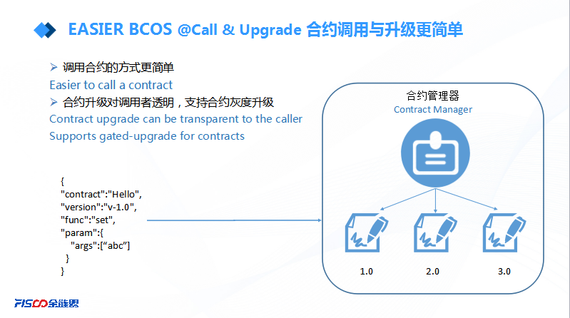

[TOC]

# CNS(Contract Name Service)服务
## 一.概述
### 1.合约调用概述
调用合约的流程包括： 编写合约、编译合约、部署合约。  
以一个简单的合约HelloWorld.sol为例子：

```solidity
//HelloWorld.sol路径为FISCO-BCOS/tool/HelloWorld.sol
pragma solidity ^0.4.2;
contract HelloWorld{
    string name;
    function HelloWorld(){
       name="Hi,Welcome!";
    }
    function get()constant returns(string){
        return name;
    }
    function set(string n){
        name=n;
    }
}
```
对合约进行编译之后可以获取到合约接口abi的描述,数据如下：

```json
[
  {
    "constant": false,
    "inputs": [
      {
        "name": "n",
        "type": "string"
      }
    ],
    "name": "set",
    "outputs": [
      
    ],
    "payable": false,
    "stateMutability": "nonpayable",
    "type": "function"
  },
  {
    "constant": true,
    "inputs": [
      
    ],
    "name": "get",
    "outputs": [
      {
        "name": "",
        "type": "string"
      }
    ],
    "payable": false,
    "stateMutability": "view",
    "type": "function"
  },
  {
    "inputs": [
      
    ],
    "payable": false,
    "stateMutability": "nonpayable",
    "type": "constructor"
  }
]
```
然后将合约部署到区块链,可以获取到一个地址address,比如：0x269ab4bc23b07efeb3c3fd52eecfc4cbe6a50859。
最后使用address结合abi,就可以实现对合约的调用,各种SDK工具的使用方式都有所不同,但是本质上都是对address与abi使用的封装。

### 2. CNS简介
从合约调用流程可以看出来,调用流程必须的元素是合约ABI以及部署合约地址address。这种方式存在以下的问题： 
1. 合约ABI描述是个很长的JSON字符串, 是调用端需要, 对使用者来说并不友好。
2. 合约地址是个魔数, 不方便记忆, 要谨慎维护, 丢失后会导致合约不可访问。
3. 在合约每次重新部署时, 调用方都需要更新合约地址。
4. 不便于进行版本管理以及合约灰度升级。

CNS合约命名服务,提供一种由命名到合约接口调用的映射关系。  
CNS中,调用合约接口时,传入合约映射的name,接口名称以及参数信息。在底层框架的CNS Manager模块维护name与合约信息的映射关系,将根据调用传入的name 、接口、参数, 转换底层EVM需要的字节码供EVM调用。  

下面给出一个图示来说明下CNS服务的优势：  
  
1. 不在需要维护并不友好的合约ABI和合约地址address。
2. 调用方式更简单友好,只需要合约映射的CNS名称,调用接口名称,参数信息。
3. 内置的版本管理特性, 为合约提供了灰度升级的可能性。

## 二.实现
### 1. 总体框架
  
在整个框架中, 命名服务模块提供命名服务, 客户端请求RPC调用合约服务的交易, 交易框架会首先访问合约命名服务模块, 从而解析出要访问的真实合约信息, 构造合约调用需要的信息, 进而对业务合约发出调用，并访问结果给客户端。
### 2. 主要模块  
#### a. 管理合约模块  
在管理合约中保存命名服务中name与合约信息的映射关系,合约具体信息包含合约地址、abi、版本号等,并且提供接口供外部辅助工具cns_manager.js实现添加、更新、覆盖、重置功能。同时,底层交易框架内存中会有一份该合约内容的备份,在该合约内容发生变动时,内存同步更新。  
- 当前CNS中实现的映射关系为 ： 合约名+合约版本号 => 合约详情(abi 合约地址等)
- 合约实现： systemcontractv2/ContractAbiMgr.sol  
- 辅助合约： ContractBase.sol(位于tool/ContractBase.sol)  
- 对部署的合约进行多版本版本管理,可以让合约继承ContractBase.sol,在构造函数中调用ContractBase.sol的构造函数初始化version成员。

- 注意：ContractAbiMgr合约在系统合约中维护,所以需要使用CNS服务时需要首先部署系统合约。  
#### b. 辅助工具  
调用管理合约提供的接口, 提供添加、更新、查询、重置功能。  
- 工具: tool/cns_manager.js  

```
babel-node cns_manager.js 
 cns_manager.js Usage: 
         babel-node cns_manager.js get    contractName [contractVersion]
         babel-node cns_manager.js add    contractName
         babel-node cns_manager.js update contractName
         babel-node cns_manager.js list [simple]
         babel-node cns_manager.js historylist contractName [contractVersion] [simple]
         babel-node cns_manager.js reset contractName [contractVersion] index

```
功能介绍： 

- 命令  ： add  
  参数  ： contractName 合约名  
  功能  ： 添加contractName的信息到管理合约中  
  注意  :  如果管理合约中contractName对应的信息已经存在,会操作失败。此时可以 1. 更新当前合约的版本号,使用CNS方式调用时,指定版本号 2. 执行update操作,强行覆盖当前信息。
```javascript
//第一次add Test成功
babel-node cns_manager.js add Test
cns add operation => cns_name = Test
         cns_name =>Test
         contract =>Test
         version  =>
         address  =>0x233c777fccb9897ad5537d810068f9c6a4344e4a
         abi      =>[{"constant":false,"inputs":[{"name":"num","type":"uint256"}],"name":"trans","outputs":[],"payable":false,"stateMutability":"nonpayable","type":"function"},{"constant":true,"inputs":[],"name":"get","outputs":[{"name":"","type":"uint256"}],"payable":false,"stateMutability":"view","type":"function"},{"constant":false,"inputs":[],"name":"Ok","outputs":[],"payable":false,"stateMutability":"nonpayable","type":"function"}]

//第二次add,失败
babel-node cns_manager.js add Test
cns_manager.js  ........................Begin........................
 [WARNING] cns add operation failed , ====> contract => Test version =>  is already exist. you can update it or change its version.
```
- 命令  ： get  
  参数  ： 1. contractName 合约名 2. contractVersion 版本号[可省略]  
  功能  ： 获取contractName对应contractVersion版本在管理合约中的信息

```javascript
babel-node cns_manager.js get HelloWorld
cns_manager.js  ........................Begin........................
 ====> contract => HelloWorld ,version => 
         contract    = HelloWorld
         version     = 
         address     = 0x269ab4bc23b07efeb3c3fd52eecfc4cbe6a50859
         timestamp   = 1516866720115 => 2018/1/25 15:52:0:115
         abi         = [{"constant":false,"inputs":[{"name":"n","type":"string"}],"name":"set","outputs":[],"payable":false,"stateMutability":"nonpayable","type":"function"},{"constant":true,"inputs":[],"name":"get","outputs":[{"name":"","type":"string"}],"payable":false,"stateMutability":"view","type":"function"},{"inputs":[],"payable":false,"stateMutability":"nonpayable","type":"constructor"}]
```
- 命令  ： update 
  参数  ： contractName 合约名
  功能  ： 更新contractName在管理合约中的信息  
  注意  ： 当contractName对应版本contractVersion在管理合约中不存在时会update失败,此时可以先执行add操作;被覆盖掉的信息可以通过historylist命令查询到,通过reset命令恢复。

```javascript
babel-node cns_manager.js update Test
cns_manager.js  ........................Begin........................
 ====> Are you sure update the cns of the contract ?(Y/N)
Y
cns update operation => cns_name = Test
         cns_name =>Test
         contract =>Test
         version  =>
         address  =>0x233c777fccb9897ad5537d810068f9c6a4344e4a
         abi      =>[{"constant":false,"inputs":[{"name":"num","type":"uint256"}],"name":"trans","outputs":[],"payable":false,"stateMutability":"nonpayable","type":"function"},{"constant":true,"inputs":[],"name":"get","outputs":[{"name":"","type":"uint256"}],"payable":false,"stateMutability":"view","type":"function"},{"constant":false,"inputs":[],"name":"Ok","outputs":[],"payable":false,"stateMutability":"nonpayable","type":"function"}]
发送交易成功: 0x1d3caff1fba49f5ad8af3d195999454d01c64d236d9ac3ba91350dd543b10c13
```
- 命令  ： list 
  参数  :  [simple]
  功能  ： 列出管理合约中所有的信息,没有simple参数时,打印合约的详情,否则只打印合约名称跟版本号。

```javascript
babel-node cns_manager.js list simple
cns_manager.js  ........................Begin........................
 cns total count => 11
        0. contract = ContractAbiMgr ,version = 
        1. contract = SystemProxy ,version = 
        2. contract = TransactionFilterChain ,version = 
        3. contract = AuthorityFilter ,version = 
        4. contract = Group ,version = 
        5. contract = CAAction ,version = 
        6. contract = ConfigAction ,version = 
        7. contract = NodeAction ,version = 
        8. contract = HelloWorld ,version = 
        9. contract = Ok ,version = 
        10. contract = Test ,version = 
```

- 命令  ： historylist 
  参数  :  contractName 合约名称 contractVersion 合约版本号[可省略] 
  功能  ： 列出contrcactName对应版本号contractVersion被update操作覆盖的所有合约信息
```javascript
babel-node cns_manager.js historylist HelloWorld
cns_manager.js  ........................Begin........................
 cns history total count => 3
 ====> cns history list index = 0 <==== 
         contract    = HelloWorld
         version     = 
         address     = 0x1d2047204130de907799adaea85c511c7ce85b6d
         timestamp   = 1516865606159 => 2018/1/25 15:33:26:159
         abi         = [{"constant":false,"inputs":[{"name":"n","type":"string"}],"name":"set","outputs":[],"payable":false,"stateMutability":"nonpayable","type":"function"},{"constant":true,"inputs":[],"name":"get","outputs":[{"name":"","type":"string"}],"payable":false,"stateMutability":"view","type":"function"},{"inputs":[],"payable":false,"stateMutability":"nonpayable","type":"constructor"}]
 ====> cns history list index = 1 <==== 
         contract    = HelloWorld
         version     = 
         address     = 0x9c3fb4dd0a3fc5e1ea86ed3d3271b173a7084f24
         timestamp   = 1516866516542 => 2018/1/25 15:48:36:542
         abi         = [{"constant":false,"inputs":[{"name":"n","type":"string"}],"name":"set","outputs":[],"payable":false,"stateMutability":"nonpayable","type":"function"},{"constant":true,"inputs":[],"name":"get","outputs":[{"name":"","type":"string"}],"payable":false,"stateMutability":"view","type":"function"},{"inputs":[],"payable":false,"stateMutability":"nonpayable","type":"constructor"}]
 ====> cns history list index = 2 <==== 
         contract    = HelloWorld
         version     = 
         address     = 0x1d2047204130de907799adaea85c511c7ce85b6d
         timestamp   = 1516866595160 => 2018/1/25 15:49:55:160
         abi         = [{"constant":false,"inputs":[{"name":"n","type":"string"}],"name":"set","outputs":[],"payable":false,"stateMutability":"nonpayable","type":"function"},{"constant":true,"inputs":[],"name":"get","outputs":[{"name":"","type":"string"}],"payable":false,"stateMutability":"view","type":"function"},{"inputs":[],"payable":false,"stateMutability":"nonpayable","type":"constructor"}]

```
- 命令  ： reset 
  参数  :  1. contractName 合约名称 2. contractVersion 合约版本号[可省略] 3. index 索引  
  功能  ： 将被覆盖的信息恢复,index为historylist查询到的索引

#### c. RPC接口

底层rpc接口的修改,支持CNS方式的调用：
> 注意：只是修改了rpc的接口,原来的请求方式仍然兼容。  
> rpc的格式详情参考：https://github.com/ethereum/wiki/wiki/JSON-RPC  

- eth_call  
```json  
请求：
{
  "jsonrpc": "2.0",
  "method": "eth_call",
  "params": [
    {
      "data": {
        "contract": "",   //调用合约名称
        "version": "",    //调用合约的版本号
        "func": "",       //调用合约的接口
        "params": [       //参数信息

        ]
      }
    },
    "latest"
  ],
  "id": 1
}

返回：
{
  "id": 1,
  "jsonrpc": "2.0",
  "result": {
    "result": [],         //返回结果,格式为json数组
    "ret_code": 0,
    "ret_msg": "success!"
  }
}

```

- eth_sendTransaction
```shell
请求：
{
  "jsonrpc": "2.0",
  "method": "eth_sendTransaction",
  "params": [
    {
      "data": {
        "contract": "",   //调用合约名称
        "version": "",    //调用合约的版本号
        "func": "",       //调用合约的接口
        "params": [       //参数
        ]
      },
      "randomid": "2"
    }
  ],
  "id": 1
}

返回：
{
  "id": 1,
  "jsonrpc": "2.0",
  "result": "" //交易hash
}
```

- eth_sendRawTransaction
  rpc请求以及返回格式跟之前完全相同,不同为之前rlp编码data字段为十六进制字符串,现在data的值改为：

```json
"data": {
        "contract": "",   //调用合约名称
        "version": "",    //调用合约的版本号
        "func": "",       //调用合约的接口
        "params": [       //参数信息
        
        ]
      }
```
#### d. RPC接口JS封装
路径：web3lib/web3sync.js  
接口：
```
callByNameService  
sendRawTransactionByNameService
```

## 三.使用例子  
本模块提供一些CNS一些场景下使用的例子, 供大家参考

```solidity
// 测试合约
// 路径 tool/HelloWorld.sol
pragma solidity ^0.4.4;
contract HelloWorld{
    string name;
    function HelloWorld(){
       name="Hi,Welcome!";
    }
    function get()constant public returns(string){
        return name;
    }
    function set(string n) public{
        name=n;
    }
}
```

- 合约部署:  
  babel-node deploy.js HelloWorld  
>   在depoy.js中, 合约部署成功时会默认调用cns_mangager add功能, 而且会默认认为文件名与合约名相同, 如果添加失败, 需要后续部署的人自己决策：  
1. 实际上文件名与合约名不相同, 重新调用cns_manager add  
2. 只是测试合约的部署,不需要处理     
3. 同一个合约修改bug或者因为其他原因需要升级, 此时可以执行update操作 
4. 当前已经add的合约仍然需要CNS方式调用, 可以修改合约的版本号(参考多版本部署)。
```javascript
    //成功例子
    babel-node deploy.js Test0
    deploy.js  ........................Start........................
    Soc File :Test0
    Test0编译成功！
    Test0合约地址 0xfc7055a9dc68ff79a58ce4f504d8c780505b2267
    Test0部署成功！
    cns add operation => cns_name = Test0
             cns_name =>Test0
             contract =>Test0
             version  =>
             address  =>0xfc7055a9dc68ff79a58ce4f504d8c780505b2267
             abi      =>[{"constant":false,"inputs":[{"name":"n","type":"string"}],"name":"set","outputs":[],"payable":false,"stateMutability":"nonpayable","type":"function"},{"constant":true,"inputs":[],"name":"get","outputs":[{"name":"","type":"string"}],"payable":false,"stateMutability":"view","type":"function"},{"constant":false,"inputs":[],"name":"HelloWorld","outputs":[],"payable":false,"stateMutability":"nonpayable","type":"function"}]
    发送交易成功: 0x84d1e6b16c58e3571f79e80588472ab8d12779234e75ceed4ac592ad1d653086

    //失败例子,表示该合约已经存在对应信息
    babel-node deploy.js HelloWorld
    deploy.js  ........................Start........................
    Soc File :HelloWorld
    HelloWorld编译成功！
    HelloWorld合约地址 0xc3869f3d9a5fc728de82cc9c807e85b77259aa3a
    HelloWorld部署成功！
     [WARNING] cns add operation failed , ====> contract => HelloWorld version =>  is already exist. you can update it or change its version.
     
```
-多版本部署  
对于add操作时,因为添加的合约对应的版本号已经存在时, 则会添加失败, 此时可以更新合约的版本号。继承ContractBase.sol指定版本号。
```solidity
pragma solidity ^0.4.4;
contract HelloWorld is ContractBase("v-1.0"){
    string name;
    function HelloWorld(){
       name="Hi,Welcome!";
    }
    function get()constant public returns(string){
        return name;
    }
    function set(string n) public{
        name=n;
    }
}
```
再次部署
```  
babel-node deploy.js HelloWorld
deploy.js  ........................Start........................
Soc File :HelloWorld
HelloWorld编译成功！
HelloWorld合约地址 0x027d156c260110023e5bd918cc243ac12be45b17
HelloWorld部署成功！
cns add operation => cns_name = HelloWorld/v-1.0
         cns_name =>HelloWorld/v-1.0
         contract =>HelloWorld
         version  =>v-1.0
         address  =>0x027d156c260110023e5bd918cc243ac12be45b17
         abi      =>[{"constant":true,"inputs":[],"name":"getVersion","outputs":[{"name":"","type":"string"}],"payable":false,"stateMutability":"view","type":"function"},{"constant":false,"inputs":[{"name":"n","type":"string"}],"name":"set","outputs":[],"payable":false,"stateMutability":"nonpayable","type":"function"},{"constant":true,"inputs":[],"name":"get","outputs":[{"name":"","type":"string"}],"payable":false,"stateMutability":"view","type":"function"},{"constant":false,"inputs":[{"name":"version_para","type":"string"}],"name":"setVersion","outputs":[],"payable":false,"stateMutability":"nonpayable","type":"function"},{"inputs":[],"payable":false,"stateMutability":"nonpayable","type":"constructor"}]
发送交易成功: 0x9a409003f5a17220809dd8e1324a36a425acaf194efd3ef1f772bbf7b49ee67c
```
此时合约版本号为： v-1.0

- RPC调用接口
```shell

1. 调用HelloWorld默认版本（即没有指定版本号）的set接口
curl -X POST --data  '{"jsonrpc":"2.0","method":"eth_sendTransaction","params":[{"data":{"contract":"HelloWorld","version":"","func":"set","params":["call defaut version"]},"randomid":"3"}],"id":1}'  "http://127.0.0.1:8746"  

{"id":1,"jsonrpc":"2.0","result":"0x77218708a73aa8c17fb9370a29254baa8f504e71b12d01d90eae0b2ef9818172"}

2. 调用HelloWorld默认版本（即没有指定版本号）的get接口
curl -X POST --data  '{"jsonrpc":"2.0","method":"eth_call","params":[{"data":{"contract":"HelloWorld","version":"","func":"get","params":[]}},"latest"],"id":1}'  "http://127.0.0.1:8746"  

{"id":1,"jsonrpc":"2.0","result":"[\"call defaut version\"]\n"}

3. 调用HelloWorld v-1.0版本的set接口
curl -X POST --data  '{"jsonrpc":"2.0","method":"eth_sendTransaction","params":[{"data":{"contract":"HelloWorld","version":"v-1.0","func":"set","params":["call v-1.0 version"]},"randomid":"4"}],"id":1}'  "http://127.0.0.1:8746"  

{"id":1,"jsonrpc":"2.0","result":"0xf43349d7be554fd332e8e4eb0c69e23292ffa8d127b0500c21109b60784aaa1d"}

4. 调用HelloWorld v-1.0版本的get接口
 curl -X POST --data  '{"jsonrpc":"2.0","method":"eth_call","params":[{"data":{"contract":"HelloWorld","version":"v-1.0","func":"get","params":[]}},"latest"],"id":1}'  "http://127.0.0.1:8746"  

{"id":1,"jsonrpc":"2.0","result":"[\"call v-1.0 version\"]\n"}
```

- 合约升级  
  如果合约需要升级的情况下, 可以执行执行update操作。  
  对HelloWorld进行升级, 首先重新部署, 因为HelloWorld之前被cns_manager添加, 所以会提示添加失败, 然后执行update操作。
```javascrpt
babel-node cns_manager.js update HelloWorld
cns_manager.js  ........................Begin........................
 ====> Are you sure update the cns of the contract ?(Y/N)
Y
cns update operation => cns_name = HelloWorld
         cns_name =>HelloWorld
         contract =>HelloWorld
         version  =>
         address  =>0x93d62e961a6801d3f614a5add207cdf45b0ff654
         abi      =>[{"constant":false,"inputs":[{"name":"n","type":"string"}],"name":"set","outputs":[],"payable":false,"stateMutability":"nonpayable","type":"function"},{"constant":true,"inputs":[],"name":"get","outputs":[{"name":"","type":"string"}],"payable":false,"stateMutability":"view","type":"function"},{"inputs":[],"payable":false,"stateMutability":"nonpayable","type":"constructor"}]
发送交易成功: 0xc8ee384185a1aaa3817474d6db6394ff6871a7bc56a15e564e7b1f57c8bfda1a

再调用get接口：
curl -X POST --data  '{"jsonrpc":"2.0","method":"eth_call","params":[{"data":{"contract":"HelloWorld","version":"","func":"get","params":[]}},"latest"],"id":1}'  "http://127.0.0.1:8746"  
{"id":1,"jsonrpc":"2.0","result":"[\"Hi,Welcome!\"]\n"}

返回 'Hi,Welcome!'。
说明当前调用的合约就是刚才部署的新合约。

```
- CNS合约重置  
  update之后, 需要将原来的合约找回, 可以通过reset进行。  
  首先查找当前合约对应版本有多少update被覆盖的合约。  
```javascript
babel-node cns_manager.js historylist HelloWorld
cns_manager.js  ........................Begin........................
 cns history total count => 4
 ====> cns history list index = 0 <==== 
         contract    = HelloWorld
         version     = 
         address     = 0x1d2047204130de907799adaea85c511c7ce85b6d
         timestamp   = 1516865606159 => 2018/1/25 15:33:26:159
         abi         = [{"constant":false,"inputs":[{"name":"n","type":"string"}],"name":"set","outputs":[],"payable":false,"stateMutability":"nonpayable","type":"function"},{"constant":true,"inputs":[],"name":"get","outputs":[{"name":"","type":"string"}],"payable":false,"stateMutability":"view","type":"function"},{"inputs":[],"payable":false,"stateMutability":"nonpayable","type":"constructor"}]
 ====> cns history list index = 1 <==== 
         contract    = HelloWorld
         version     = 
         address     = 0x9c3fb4dd0a3fc5e1ea86ed3d3271b173a7084f24
         timestamp   = 1516866516542 => 2018/1/25 15:48:36:542
         abi         = [{"constant":false,"inputs":[{"name":"n","type":"string"}],"name":"set","outputs":[],"payable":false,"stateMutability":"nonpayable","type":"function"},{"constant":true,"inputs":[],"name":"get","outputs":[{"name":"","type":"string"}],"payable":false,"stateMutability":"view","type":"function"},{"inputs":[],"payable":false,"stateMutability":"nonpayable","type":"constructor"}]
 ====> cns history list index = 2 <==== 
         contract    = HelloWorld
         version     = 
         address     = 0x1d2047204130de907799adaea85c511c7ce85b6d
         timestamp   = 1516866595160 => 2018/1/25 15:49:55:160
         abi         = [{"constant":false,"inputs":[{"name":"n","type":"string"}],"name":"set","outputs":[],"payable":false,"stateMutability":"nonpayable","type":"function"},{"constant":true,"inputs":[],"name":"get","outputs":[{"name":"","type":"string"}],"payable":false,"stateMutability":"view","type":"function"},{"inputs":[],"payable":false,"stateMutability":"nonpayable","type":"constructor"}]
 ====> cns history list index = 3 <==== 
         contract    = HelloWorld
         version     = 
         address     = 0x269ab4bc23b07efeb3c3fd52eecfc4cbe6a50859
         timestamp   = 1516866720115 => 2018/1/25 15:52:0:115
         abi         = [{"constant":false,"inputs":[{"name":"n","type":"string"}],"name":"set","outputs":[],"payable":false,"stateMutability":"nonpayable","type":"function"},{"constant":true,"inputs":[],"name":"get","outputs":[{"name":"","type":"string"}],"payable":false,"stateMutability":"view","type":"function"},{"inputs":[],"payable":false,"stateMutability":"nonpayable","type":"constructor"}]

然后查看需要被找回的合约是哪个。
babel-node cns_manager.js reset HelloWorld 3
cns_manager.js  ........................Begin........................
 ====> Are you sure update the cns of the contract ?(Y/N)
Y
cns update operation => cns_name = HelloWorld
         cns_name =>HelloWorld
         contract =>HelloWorld
         version  =>
         address  =>0x269ab4bc23b07efeb3c3fd52eecfc4cbe6a50859
         abi      =>[{"constant":false,"inputs":[{"name":"n","type":"string"}],"name":"set","outputs":[],"payable":false,"stateMutability":"nonpayable","type":"function"},{"constant":true,"inputs":[],"name":"get","outputs":[{"name":"","type":"string"}],"payable":false,"stateMutability":"view","type":"function"},{"inputs":[],"payable":false,"stateMutability":"nonpayable","type":"constructor"}]
发送交易成功: 0x4809a6105916a483ca70c4efe8e306bc01ca5d937515320d09e94a83f4a91b76

此时再调用HelloWorld的get接口:
curl -X POST --data  '{"jsonrpc":"2.0","method":"eth_call","params":[{"data":{"contract":"HelloWorld","version":"","func":"get","params":[]}},"latest"],"id":1}'  "http://127.0.0.1:8746"  
{"id":1,"jsonrpc":"2.0","result":"[\"call defaut version\"]\n"}

返回为call defaut version, 说明当前CNS调用的合约已经是最后一次比覆盖的合约。
```

- js调用  

```javascript
//调用HelloWorld get接口
var result = web3sync.callByNameService("HelloWorld","get","",[]);  

//调用HelloWorld v-1.0 get接口
var result = web3sync.callByNameService("HelloWorld","get","v-1.0",[]);  

//调用HelloWorld set接口 sendRawTransaction
var result = web3sync.sendRawTransactionByNameService(config.account,config.privKey,"HelloWorld","set","",["test message!"]);  

//调用HelloWorld v-1.0 set接口 sendRawTransaction
var result = web3sync.sendRawTransactionByNameService(config.account,config.privKey,"HelloWorld","set","v-1.0",["test message!"]); 
```

## 附录一.  重载函数的调用  
solidity支持函数重载, 当solidity中存在重载函数时, 使用CNS调用的参数跟之前有所不同:

```
//file : OverloadTest.sol
pragma solidity ^0.4.4;
contract OverloadTest {
    string public msg;
    uint256 public u;
    
    function OverloadTest() {
        msg = "OverloadTest Test";
        u = 0x01;
    }
    
    function set(string _msg) public {
        msg = _msg;
    }
    function set(uint256 _u) public {
        u = _u;
    }
    
    function get() public constant returns(string){
        return msg;
    }
    
    function get(uint256 i) public constant returns(uint256){
        return u;
    }
}
```
在OverloadTest.sol合约中:  
set函数是一个重载函数, 一个函数原型为set(string),另一个为set(uint256).  
get函数也是一个重载函数, 一个函数原型为get(), 另一个为get(uint256).

部署合约：

```
babel-node deploy.js OverloadTest
RPC=http://0.0.0.0:8546
Ouputpath=./output/
deploy.js  ........................Start........................
OverloadTest编译成功！
发送交易成功: 0xff8a5708b3f7b335570a50639f2073e5e0b8b2002faa909dc75727059de94f4e
OverloadTest合约地址 0x919868496524eedc26dbb81915fa1547a20f8998
OverloadTest部署成功！
cns add operation => cns_name = OverloadTest
         cns_name =>OverloadTest
         contract =>OverloadTest
         version  =>
         address  =>0x919868496524eedc26dbb81915fa1547a20f8998
         abi      =>[{"constant":false,"inputs":[{"name":"_msg","type":"string"}],"name":"set","outputs":[],"payable":false,"type":"function"},{"constant":false,"inputs":[{"name":"_u","type":"uint256"}],"name":"set","outputs":[],"payable":false,"type":"function"},{"constant":true,"inputs":[],"name":"msg","outputs":[{"name":"","type":"string"}],"payable":false,"type":"function"},{"constant":true,"inputs":[],"name":"get","outputs":[{"name":"","type":"string"}],"payable":false,"type":"function"},{"constant":true,"inputs":[{"name":"i","type":"uint256"}],"name":"get","outputs":[{"name":"","type":"uint256"}],"payable":false,"type":"function"},{"constant":true,"inputs":[],"name":"u","outputs":[{"name":"","type":"uint256"}],"payable":false,"type":"function"},{"inputs":[],"payable":false,"type":"constructor"}]
===>> namecall params = {"contract":"ContractAbiMgr","func":"addAbi","version":"","params":["OverloadTest","OverloadTest","","[{\"constant\":false,\"inputs\":[{\"name\":\"_msg\",\"type\":\"string\"}],\"name\":\"set\",\"outputs\":[],\"payable\":false,\"type\":\"function\"},{\"constant\":false,\"inputs\":[{\"name\":\"_u\",\"type\":\"uint256\"}],\"name\":\"set\",\"outputs\":[],\"payable\":false,\"type\":\"function\"},{\"constant\":true,\"inputs\":[],\"name\":\"msg\",\"outputs\":[{\"name\":\"\",\"type\":\"string\"}],\"payable\":false,\"type\":\"function\"},{\"constant\":true,\"inputs\":[],\"name\":\"get\",\"outputs\":[{\"name\":\"\",\"type\":\"string\"}],\"payable\":false,\"type\":\"function\"},{\"constant\":true,\"inputs\":[{\"name\":\"i\",\"type\":\"uint256\"}],\"name\":\"get\",\"outputs\":[{\"name\":\"\",\"type\":\"uint256\"}],\"payable\":false,\"type\":\"function\"},{\"constant\":true,\"inputs\":[],\"name\":\"u\",\"outputs\":[{\"name\":\"\",\"type\":\"uint256\"}],\"payable\":false,\"type\":\"function\"},{\"inputs\":[],\"payable\":false,\"type\":\"constructor\"}]","0x919868496524eedc26dbb81915fa1547a20f8998"]}
发送交易成功: 0x56e2267cd46fddc11abc4f38d605adc1f76d3061b96cf4026b09ace3502d2979
```

> **对于重载函数, 在使用CNS方式调用时, func参数需要指定完整的函数原型, 不能仅仅只指定函数的名称**：

调用get()时, "func":"get()"  
调用get(uint256 i)时, "func":"get(uint256)"  
调用set(string _msg)时, "func":"set(string)"  
调用set(uint256 _u)时, "func":"set(uint256)"  

下面是调用的示例：  

```
调用get()接口:
curl -X POST --data  '{"jsonrpc":"2.0","method":"eth_call","params":[{"data":{"contract":"OverloadTest","version":"","func":"get","params":[]}},"latest"],"id":1}'  "http://127.0.0.1:8546"  
{"id":1,"jsonrpc":"2.0","result":"[\"OverloadTest Test\"]\n"}

调用get(uint256 i)接口：
curl -X POST --data  '{"jsonrpc":"2.0","method":"eth_call","params":[{"data":{"contract":"OverloadTest","version":"","func":"get(uint256)","params":[1]}},"latest"],"id":1}'  "http://127.0.0.1:8546"  
{"id":1,"jsonrpc":"2.0","result":"[\"1\"]\n"}

使用js调用set(string _msg)：
var result = web3sync.sendRawTransactionByNameService(config.account,config.privKey,"OverloadTest","set(string)","",["test message!"]);
 
使用js调用set(uint256 _i)):
var result = web3sync.sendRawTransactionByNameService(config.account,config.privKey,"OverloadTest","set(uint256)","",["0x111"]);
```

## 附录二.  java客户端的使用.  

我们还是以上述HelloWorld.sol合约为例,提供一个完整的例子。

1. 参考上面的流程, 部署HelloWorld.sol合约, 使用cns_manager.js工具注册HelloWorld合约信息到CNS管理合约。 
2. 下载web3sdk, 版本号需要>=V1.1.0, web3sdk的使用以及下载：https://github.com/FISCO-BCOS/web3sdk
3. 使用web3sdk生成HelloWorld的java wrap代码[参考教程](https://github.com/FISCO-BCOS/web3sdk#五合约编译及java-wrap代码生成)。在示例中使用HelloWorld.sol生成的java代码的包名为:org.bcos.cns, 生成的代码为：
```java
package org.bcos.cns;

import java.math.BigInteger;
import java.util.Arrays;
import java.util.Collections;
import java.util.concurrent.Future;
import org.bcos.channel.client.TransactionSucCallback;
import org.bcos.web3j.abi.TypeReference;
import org.bcos.web3j.abi.datatypes.Function;
import org.bcos.web3j.abi.datatypes.Type;
import org.bcos.web3j.abi.datatypes.Utf8String;
import org.bcos.web3j.crypto.Credentials;
import org.bcos.web3j.protocol.Web3j;
import org.bcos.web3j.protocol.core.methods.response.TransactionReceipt;
import org.bcos.web3j.tx.Contract;
import org.bcos.web3j.tx.TransactionManager;

/**
 * Auto generated code.<br>
 * <strong>Do not modify!</strong><br>
 * Please use the <a href="https://docs.web3j.io/command_line.html">web3j command line tools</a>, or {@link org.bcos.web3j.codegen.SolidityFunctionWrapperGenerator} to update.
 *
 * <p>Generated with web3j version none.
 */
public final class HelloWorld extends Contract {
    private static final String BINARY = "6060604052341561000c57fe5b5b604060405190810160405280600b81526020017f48692c57656c636f6d652100000000000000000000000000000000000000000081525060009080519060200190610059929190610060565b505b610105565b828054600181600116156101000203166002900490600052602060002090601f016020900481019282601f106100a157805160ff19168380011785556100cf565b828001600101855582156100cf579182015b828111156100ce5782518255916020019190600101906100b3565b5b5090506100dc91906100e0565b5090565b61010291905b808211156100fe5760008160009055506001016100e6565b5090565b90565b6102e2806101146000396000f30060606040526000357c0100000000000000000000000000000000000000000000000000000000900463ffffffff1680634ed3885e146100465780636d4ce63c146100a0575bfe5b341561004e57fe5b61009e600480803590602001908201803590602001908080601f01602080910402602001604051908101604052809392919081815260200183838082843782019150505050505091905050610139565b005b34156100a857fe5b6100b0610154565b60405180806020018281038252838181518152602001915080519060200190808383600083146100ff575b8051825260208311156100ff576020820191506020810190506020830392506100db565b505050905090810190601f16801561012b5780820380516001836020036101000a031916815260200191505b509250505060405180910390f35b806000908051906020019061014f9291906101fd565b505b50565b61015c61027d565b60008054600181600116156101000203166002900480601f0160208091040260200160405190810160405280929190818152602001828054600181600116156101000203166002900480156101f25780601f106101c7576101008083540402835291602001916101f2565b820191906000526020600020905b8154815290600101906020018083116101d557829003601f168201915b505050505090505b90565b828054600181600116156101000203166002900490600052602060002090601f016020900481019282601f1061023e57805160ff191683800117855561026c565b8280016001018555821561026c579182015b8281111561026b578251825591602001919060010190610250565b5b5090506102799190610291565b5090565b602060405190810160405280600081525090565b6102b391905b808211156102af576000816000905550600101610297565b5090565b905600a165627a7a723058205f78cf9b4365c5a429ff9e4ebc4abf1f9e9d44f0a41c19c85c9d394438f3fe7b0029";

    public static final String ABI = "[{\"constant\":false,\"inputs\":[{\"name\":\"n\",\"type\":\"string\"}],\"name\":\"set\",\"outputs\":[],\"payable\":false,\"type\":\"function\"},{\"constant\":true,\"inputs\":[],\"name\":\"get\",\"outputs\":[{\"name\":\"\",\"type\":\"string\"}],\"payable\":false,\"type\":\"function\"},{\"inputs\":[],\"payable\":false,\"type\":\"constructor\"}]";

    private HelloWorld(String contractAddress, Web3j web3j, Credentials credentials, BigInteger gasPrice, BigInteger gasLimit, Boolean isInitByName) {
        super(BINARY, contractAddress, web3j, credentials, gasPrice, gasLimit, isInitByName);
    }

    private HelloWorld(String contractAddress, Web3j web3j, TransactionManager transactionManager, BigInteger gasPrice, BigInteger gasLimit, Boolean isInitByName) {
        super(BINARY, contractAddress, web3j, transactionManager, gasPrice, gasLimit, isInitByName);
    }

    private HelloWorld(String contractAddress, Web3j web3j, Credentials credentials, BigInteger gasPrice, BigInteger gasLimit) {
        super(BINARY, contractAddress, web3j, credentials, gasPrice, gasLimit, false);
    }

    private HelloWorld(String contractAddress, Web3j web3j, TransactionManager transactionManager, BigInteger gasPrice, BigInteger gasLimit) {
        super(BINARY, contractAddress, web3j, transactionManager, gasPrice, gasLimit, false);
    }

    public Future<TransactionReceipt> set(Utf8String n) {
        Function function = new Function("set", Arrays.<Type>asList(n), Collections.<TypeReference<?>>emptyList());
        return executeTransactionAsync(function);
    }

    public void set(Utf8String n, TransactionSucCallback callback) {
        Function function = new Function("set", Arrays.<Type>asList(n), Collections.<TypeReference<?>>emptyList());
        executeTransactionAsync(function, callback);
    }

    public Future<Utf8String> get() {
        Function function = new Function("get", 
                Arrays.<Type>asList(), 
                Arrays.<TypeReference<?>>asList(new TypeReference<Utf8String>() {}));
        return executeCallSingleValueReturnAsync(function);
    }

    public static Future<HelloWorld> deploy(Web3j web3j, Credentials credentials, BigInteger gasPrice, BigInteger gasLimit, BigInteger initialWeiValue) {
        return deployAsync(HelloWorld.class, web3j, credentials, gasPrice, gasLimit, BINARY, "", initialWeiValue);
    }

    public static Future<HelloWorld> deploy(Web3j web3j, TransactionManager transactionManager, BigInteger gasPrice, BigInteger gasLimit, BigInteger initialWeiValue) {
        return deployAsync(HelloWorld.class, web3j, transactionManager, gasPrice, gasLimit, BINARY, "", initialWeiValue);
    }

    public static HelloWorld load(String contractAddress, Web3j web3j, Credentials credentials, BigInteger gasPrice, BigInteger gasLimit) {
        return new HelloWorld(contractAddress, web3j, credentials, gasPrice, gasLimit, false);
    }

    public static HelloWorld load(String contractAddress, Web3j web3j, TransactionManager transactionManager, BigInteger gasPrice, BigInteger gasLimit) {
        return new HelloWorld(contractAddress, web3j, transactionManager, gasPrice, gasLimit, false);
    }

    public static HelloWorld loadByName(String contractName, Web3j web3j, Credentials credentials, BigInteger gasPrice, BigInteger gasLimit) {
        return new HelloWorld(contractName, web3j, credentials, gasPrice, gasLimit, true);
    }

    public static HelloWorld loadByName(String contractName, Web3j web3j, TransactionManager transactionManager, BigInteger gasPrice, BigInteger gasLimit) {
        return new HelloWorld(contractName, web3j, transactionManager, gasPrice, gasLimit, true);
    }
}
```

在生成的代码中多了两个loadByName函数。

4. 函数调用 

```
package org.bcos.main;

import java.math.BigInteger;
import java.util.concurrent.Future;

import org.bcos.channel.client.Service;
import org.bcos.cns.HelloWorld;
import org.bcos.web3j.abi.datatypes.Utf8String;
import org.bcos.web3j.crypto.Credentials;
import org.bcos.web3j.crypto.ECKeyPair;
import org.bcos.web3j.crypto.Keys;
import org.bcos.web3j.protocol.Web3j;
import org.bcos.web3j.protocol.channel.ChannelEthereumService;
import org.bcos.web3j.protocol.core.methods.response.TransactionReceipt;
import org.springframework.context.ApplicationContext;
import org.springframework.context.support.ClassPathXmlApplicationContext;

public class Main {
	public static void main(String[] args) throws Exception {
		
		ApplicationContext context = new ClassPathXmlApplicationContext("classpath:applicationContext.xml");
		//init service 
		Service service = context.getBean(Service.class);
        ChannelEthereumService channelEthereumService = new ChannelEthereumService();
        channelEthereumService.setTimeout(10000);
        channelEthereumService.setChannelService(service);
        
        //init web3
        Web3j web3j = Web3j.build(channelEthereumService);
        service.run();
        
        //初始化交易签名私钥
        ECKeyPair keyPair = Keys.createEcKeyPair();
        Credentials credentials = Credentials.create(keyPair);
		
    	BigInteger gasPrice = new BigInteger("99999999");
    	BigInteger gasLimit = new BigInteger("99999999");
    	
    	//通过loadByName方式构建合约对象时, 后面通过合约对象调用合约接口时, 会以CNS的方式调用
    	HelloWorld instance = HelloWorld.loadByName("HelloWorld", web3j, credentials, gasPrice , gasLimit);
    	
    	//调用HelloWorld set接口
    	Future<TransactionReceipt> receiptResult = instance.set(new Utf8String("HelloWorld Test."));
    	receiptResult.get();
    	
    	//调用HelloWorld get接口
		Future<Utf8String> result = instance.get();
		System.out.println("HelloWorld get result = " + result.get().toString());
		
		
		return;
	}
}

```
**通过loadByName方式构建合约对象时, 后面通过合约对象调用合约接口时, 会以CNS的方式调用。**   

> HelloWorld instance = HelloWorld.loadByName("HelloWorld", web3j, credentials, gasPrice , gasLimit);  

HelloWorld的合约对象通过loadByName方式构建, 所以后续的get跟set的调用都是以CNS方式进行调用的。

* 说明：  
对于合约XX.sol生成的java Wrap代码中的loadByName原型如下：

```
 public static XX loadByName(String contractName, Web3j web3j, Credentials credentials, BigInteger gasPrice, BigInteger gasLimit) {
        return new XX(contractName, web3j, credentials, gasPrice, gasLimit, true);
    }

public static XX loadByName(String contractName, Web3j web3j, TransactionManager transactionManager, BigInteger gasPrice, BigInteger gasLimit) {
        return new XX(contractName, web3j, transactionManager, gasPrice, gasLimit, true);
    }
```
其中, contractname参数格式为：合约的名称@合约版本号, 如果合约没有版本号, 则为合约的名称。  

5. 总结
使用java客户端调用CNS的步骤为:  
a. 使用JS工具部署合约.  
b. 使用cns_nameger.js工具注册合约信息到CNS管理合约.  
c. 使用websdk工具生成合约的java Wrap代码.  
d. 将生成的代码加入自己的工程, 通过loadByName接口构造合约对象.  
e. 调用合约接口.
    	
    	
    	


