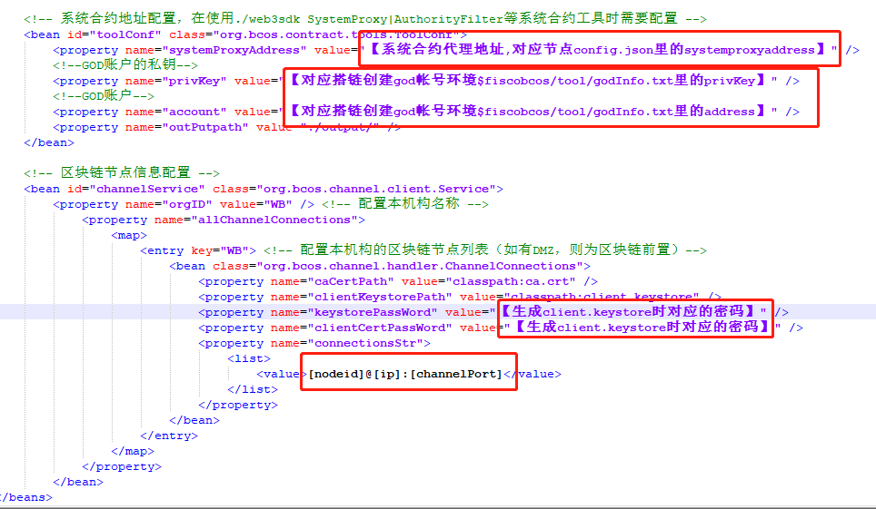

# **FISCO BCOS“极简”Java应用开发入门**

**作者：fisco-dev**   

FISCO BCOS区块链平台部分是用于搭建多方参与的联盟链，业务开发时，可以结合智能合约和Java 版的web3sdk（更多语言适配中），开发向区块链部署智能合约、发送交易、获得结果的业务模块。FISCO BCOS平台会提供相关的sdk、样例等。

本文试图介绍如何step by step的从头开发一个最简的Java业务模块，然后再基于这个模块，跑通流程，扩展更多的功能。

P.S.也可以直接参考[存证业务样例](https://github.com/FISCO-BCOS/evidenceSample), 这是一个带完整业务流程的应用样例。

## 前置条件 

1.按照[FISCO BCOS](https://github.com/FISCO-BCOS/FISCO-BCOS) 的“2.2 安装说明”，搭建并跑起来至少一个节点，推荐搭建4个节点的链，体验整个部署流程。可使用一键搭链脚本、Docker、物料包等方式快速部署，本文不做详细阐述。如搭链有问题，可到社区里提问（参见页面里 “6.联系我们” ）。目前推荐基于[FISCO BCOS 1.3以上的版本](https://github.com/FISCO-BCOS/FISCO-BCOS/releases)进行搭链，采用release的版本搭链更加稳定，如有任何问题也便于定位解决。

在搭链的过程中，请注意记录和整理各种关键信息，如节点ID、IP、端口、god帐号、系统代理合约地址、证书、密码等，妥善保管，防止泄露，后续可供客户端配置使用。

2.下载并编译[web3sdk](https://github.com/FISCO-BCOS/web3sdk)。web3sdk自带大量的接口，可全面读写区块链信息，基于web3sdk生成的合约接口代码基本上也可以做到不需要手写任何abi解析即可面向对象的与合约交互，编程复杂度大为降低。

因为该sdk目前的脚本是在linux上编写的shell脚本，建议在linux服务器上下载编译和使用，如果在windows、mac等开发机上开发，可以把生成的jar包复制到开发机器上。这里注意两点：第一，编译sdk时，必须使用jdk1.8不能使用openjdk；第二，公网以太坊的web3j不能直接使用，FISCO-BCOS使用的版本已经做了大幅修改。

3.在web3sdk同一台机器上，需要智能合约编译器fisco-solc,参见[使用手册](https://github.com/FISCO-BCOS/FISCO-BCOS/tree/master/doc/manual)中 “1.2.2 安装FISCO BCOS的智能合约编译器“里的下载部署。

以上，主要环境就绪：

1：链节点环境，客户端将跟这些节点通信

2：编译环境，包括fisco-bcos平台代码的环境和web3sdk所在的环境

3：客户端开发环境，编写java项目代码的环境

以下步骤需要在多个环境中切换来切换去操作，要清晰的记住和快速切换环境，或者事先准备好各种相关配置信息（熟悉之后）。

## 1. 编写编译智能合约（在编译环境）

本样例提供一个最简智能合约，演示对字符串和整型数的基本操作，包括设置和读取计数器名字、增加计数、读取当前计数。并通过receipt log的方式，把修改记录log到block里，供客户端查询参考。这里提一下，receipt log用处很大，可以是区块链和业务端同步交易处理过程和结果信息的有效渠道。 合约代码如下，非常的简单。

[Counter.sol](./images/Counter.sol)

首先到下载编译了web3sdk的linux服务器上，进入web3sdk目录，如/mydata/web3sdk。

我的做法是在我的环境变量文件里设定路径。

```
vi ~/.bash_profile （或/etc/profile，随意）
```

加入两行：

```
export web3sdk=/mydata/web3sdk #注意指向正确的路径
export fiscobcos=/mydata/FISCO-BCOS #注意指向正确的路径‘’‘ 
```

保存退出，并执行命令使配置生效。

```
source ~/.bash_profile
```
然后

```
cd $web3sdk/dist/contracts
```
把Counter.sol放置到$web3sdk/dist/contracts下。
```
cd $web3sdk/bin
```
执行编译合约的任务
```
./compile.sh org.bcosliteclient #注意参数是java项目调用合约的代码所在包名
cd $web3sdk/dist/output
```
可以看到应该生成了合约的.abi, .bin等文件，以及在当前目录的子目录下 org/bcosliteclient/Counter.java文件。这个java文件可以复制到客户端开发环境里，后续建立的java工程的对应的包路径下。

web3sdk的dist目录结构中和以上命令相关的部分如下:

|-- bin     #comple.sh命令行工具所在目录

|-- contracts #要编译的合约都放这个目录

|-- output  #编译成功的输出目录

​    `-- org/bcosliteclient  #指定包名，则合约编译成功后输出到这个目录

## 2. 部署合约 （在编译环境）

部署合约有两种方式，一种是采用fisco bcos平台的脚本工具。
```
cd $web3sdk/dist/contracts
cp Counter.sol $fiscobcos/tool #假定$fiscobcos环境变量已经设定，在我的服务器上是/mydata/FISCO-BCOS
babel-node deploy.js Counter #注意没有.sol后缀
```
屏幕打印：
```
deploy.js  
........................Start........................
Soc File :Counter
Warning: This is a pre-release compiler version, please do not use it in production.
Countercomplie success！
send transaction success: 0x97d6484ee835935542a87640cdd2522496214aa22700e5c6d80bdd56744d5381
Countercontract address:0x2ae8d29ef2392c7e16003b387ed52def707769e2
Counter deploy success!
```
注意把 0x2ae8d29ef2392c7e16003b387ed52def707769e2这个地址(每次运行都会有不同），记录下来。

或者在*$fiscobcos/tool/output*目录下的Counter.address文件里也会保存最近一次部署所得的地址，可cat *$fiscobcos/tool/output/Counter.address*查看

另外一种是可以通过java客户端直接部署，在java代码部分介绍。

## 3. 为客户端生成安全通信的证书client.keystore（在编译环境）

注意，这一步其实是和搭链密切相关的，搭链时，已经指定了特定机构，这一步需要和搭链时的机构名，证书等使用相同的信息，否则无法客户端无法和节点通信，建议就在搭链时的操作环境下执行。

假定是基于1.3.x版本搭建的链，
```
cd $fiscobcos/cert
```
执行
```
./sdk.sh [机构名] org.bcosliteclient
```
根据提示输入一些信息，包括【客户端keystore密码】等，请牢记相关密码

将在当前目录的 [机构名]/org.bcosclient目录下，可见生成的文件。

把ca.crt, client.keystore这两个文件，复制到【客户端开发环境】上java项目的classpath路径下。

## 4.建立一个最简的java项目（在客户端开发环境）

开发环境：依赖jdk1.8, gradle等常规的java开发工具，按这些工具的官方安装方式进行安装即可。

打开eclispe建立一个简单的java app工程，假定命名bcosliteclient（也可以直接下载附件的工程,在eclipse里直接import-> exist gradle project）。建议在workspace里也import进web3sdk的工程代码，便于调试和阅读接口代码，查看类定义和区块链接口等。

[bcosliteclient.zip](./images/bcosliteclient.zip)

可使用附件工程里的build.gradle配置文件，包含了基本的java库依赖，在classpath下放置附件工程里applicationContext.xml文件（基于web3sdk1.2版本）,默认的log4j2.xml配置文件默认把所有信息打印到控制台，便于观察，可以根据自己的喜好和需要修改

在项目目录下执行gradle build ，应该会自动拉取所有相关java库到项目的lib目录下。

同时也把fisco bcos的web3sdk.jar复制到项目的lib目录下。

对java项目进行必要的配置，如文本编码方式，build path等，创建一个空的带main入口的java文件，如在org.bcosclient包路径下的bcosliteclient.java，写一两行打印输出什么的，保证这个简单的java项目能正常编译跑通，避免出现开发环境问题。

## 5. 为java客户端配置相关信息（在客户端开发环境）

打开java项目的applicationContext.xml文件,部分信息可以先用默认的,先关注这些配置项



找到”区块链节点信息配置”一节，配置密码  
```
    <property name="keystorePassWord" value="【生成client.keystore时对应的密码】" />

    <property name="clientCertPassWord" value="【生成client.keystore时对应的密码】" />
```

配置节点信息：
```
<property name="connectionsStr">

    <list>

	      <value>【节点id】@【IP】:【端口】</value>

    </list>

</property>
```

节点id、ip、端口，和需要连接的节点必须一致。

如节点服务器上，节点数据目录所在路径为/mydata/nodedata-1/，那么节点id可以在/mydata/nodedata-1/data/node.nodeid文件里查到，而其他信息在/mydata/nodedata-1/config.json里可以查到。

注意，这里的端口是对应config.json里的channelPort，而不是rpcport或p2pport。

在list段里可以配置多个value，对应多个节点的信息，以实现客户端多活通信。

另外，可以进行系统合约地址配置，在调用SystemProxy|AuthorityFilter等系统合约工具时需要配置。对应信息需要搭链时的服务器环境去查询：
```
	<bean id="toolConf" class="org.bcos.contract.tools.ToolConf">

	    <property name="systemProxyAddress" value="【系统合约代理地址,对应节点config.json里的systemproxyaddress】" />

     <!--GOD账户的私钥-->

     <property name="privKey" value="【对应搭链创建god帐号环境$fiscobcos/tool/godInfo.txt里的privKey】" />

     <!--GOD账户-->

	    <property name="account" value="【对应搭链创建god帐号环境$fiscobcos/tool/godInfo.txt里的address】" />

    	<property name="outPutpath" value="./output/" />

	</bean>
```
## 6. 编写java客户端代码调用合约（在客户端开发环境）

示例用一个单独的CounterClient.java文件来包含所有相关代码，包括初始化客户端，部署合约，修改名字，发交易调用计数器计数，查询交易回执等。注意项目目录下的Counter.java是由web3sdk的compile.sh工具根据Counter.sol合约自动生成的，不需要进行修改。

代码相当简单，可直接阅读和使用。

[CounterClient.java](./images/CounterClient.java)

注意，如果采用java客户端部署合约，则把main方法里的deployCounter()注释去掉。

代码里对应sol合约的接口，做了一次setname交易，一次addcount交易, 并获取交易后的结果，解析receipt（对应sol合约里的event）里的日志信息。

采用了java的Future特性来等待区块链共识，示例代码是同步堵塞等待，可以根据自己的需要，基于Future改为异步等待或响应式通知。

运行后，屏幕打印出以下信息，则大功告成
```
2018-07-09 18:25:51.963 [main] INFO  bcosliteclient(CounterClient.java:90) - setname-->oldname:[MyCounter from:500,inc：100],newname=[MyCounter from:500,inc：100]

2018-07-09 18:25:51.980 [main] INFO  bcosliteclient(CounterClient.java:98) - Current Counter:600

2018-07-09 18:25:51.984 [main] INFO  bcosliteclient(CounterClient.java:106) - addcount-->inc:100,before：500,after：600,memo=when tx done,counter inc 100

2018-07-09 18:25:51.998 [main] INFO  bcosliteclient(CounterClient.java:145) - <--startBlockNumber = 251,finish blocknmber=252
```
到此为止，已经有了一条可运行的链，一个可自由发挥的客户端，可以继续深度开发体验如CNS，系统合约，权限等更多的FISCO BCOS功能了。
