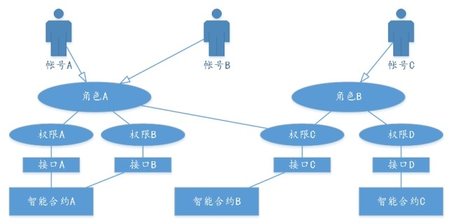
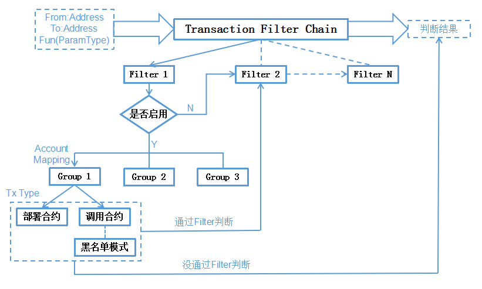
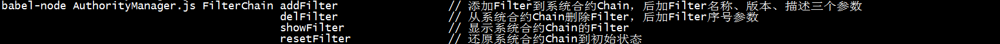
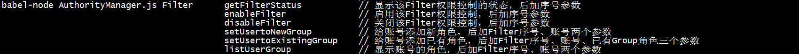
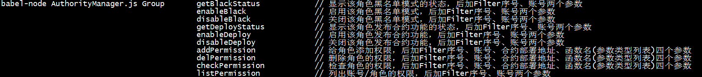
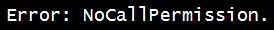

# FISCO BCOS权限模型
**作者：fisco-dev**  

## 1、FISCO BCOS权限模型（ARPI）介绍
与可自由加入退出、自由交易、自由检索的公有链相比，联盟链有准入许可、交易多样化、基于商业上隐私及安全考虑、高稳定性等要求。因此，联盟链在实践过程中需强调“权限”及“控制”的理念。

为体现“权限”及“控制”理念，FISCO BCOS平台基于**系统级权限控制**和**接口级权限控制**的思想，提出ARPI(Account—Role—Permission—Interface)权限控制模型。

系统级权限控制指从系统级别控制一个账号能否部署新合约，以及能否发起对已有合约的调用。在一账号发起请求后到具体部署合约（或调用合约）的操作之前，由系统进行判断和控制，拒绝越权的操作。接口级权限控制是指权限粒度细化到合约的接口级别，当一个新合约部署生效后，管理员可赋予某个账号调用该合约全部或部分接口的权限。

在**ARPI权限控制模型**中，分别有**账号**、**角色**、**权限**、**接口**四类对象。账号和角色的对应关系为N:1，即一个账号（个人或组织）只能对应到一个角色，但一个角色可以包含零个到多个账号。在实际操作中，同一角色可能有多个账号，但每个账号使用独立且唯一的公私钥对，发起交易时使用其私钥进行签名，接收方可通过公钥验签知道交易具体是由哪个账号发出，实现交易的可控及后续监管的追溯。角色与权限的对应关系为N:M，即一个角色拥有多个权限的集合，同时一个权限也能被多个角色所拥有。ARPI模型中权限粒度将细化到合约的接口级别，即一角色下的账号如拥有某个权限，则能调用该权限下智能合约的一个或多个接口。四类对象的整体关系可用下图描述。
 

## 2、FISCO BCOS权限模型（ARPI）框架实现
TransactionFilterChain合约在部署系统代理合约时，将首次被部署。系统把TransactionFilterChain合约地址记录在系统路由表中，作为权限控制判断的入口，后续整个系统内权限相关的增删改查也将通过系统合约进行维护。所有权限内容记录在区块链上。交易请求发起后，系统将访问系统合约表查询该交易发起方是否有对应的权限。如果具有权限，执行交易；如果不具备，则抛出异常提示。权限控制判断的整体流程见下图描述。

  

上述所提及的权限行为包括：A)能否部署合约，只有通过审核的合约才能发布到链上及供后续执行；B)能否调用合约，只有具有特定权限的账号才能通过对合约接口的调用来实现特定功能的系统控制及业务交易。

对权限控制判断流程的进一步说明：

2.1、TransactionFilterChain合约中可包含数个相互独立的Filter，每个Filter为具体的权限控制判断逻辑。用户只有通过整条TransactionFilterChain上所有Filter的权限判断，才能认为通过系统的权限控制判断，具备特定权限。每个Filter可由联盟链中不同成员负责管理，单独添加具体权限。

2.2、对于每一个Filter，均有是否**启用权限控制**的状态区分，当处于启用权限控制状态时，才进行Filter的权限判断。Filter初始化为关闭权限控制。

2.3、一个Filter内部有不同的Group，当进行权限控制判断时，先根据发起交易方（Account）所属的角色（Role），找到对应的Group及权限列表（Permission）。

2.4、Group内部将区分是**部署合约**还是**调用合约**的交易类型，部署合约的权限判断逻辑的输入是发起交易地址，调用合约的权限判断逻辑的输入是发起交易地址、被调用合约地址、调用函数及参数列表。Group初始化为没有部署合约权限。

2.5、在调用合约判断过程中，存在**黑名单模型**的判断。即使链上记录某角色具有调用一接口权限，但如果启用黑名单模式，权限控制的判断接口将返回为没有权限。Group初始化为非黑名单模型。

2.6、智能合约的函数名+参数类型列表组成一个**接口描述**。

2.7、**合约再次部署后地址将发生变化，需重新注册权限。**

## 3、FISCO BCOS在联盟链权限控制上的实践
角色和权限总体来说是与场景强相关的，不同业务规则和系统构建，将有不同的角色和权限规划。FISCO BCOS根据以往经验，在此列出供参考的角色体系定义及角色对应的活动权限示例，作为权限控制的一个模型。

- **链超级管理者（上帝账号）**：链超级管理者由联盟链管理委员会或公选出来的人员担任，具有所有权限，包括赋予权限的权限，可部署及执行所有合约。**其权限描述为**：给用户分配角色，给角色分配权限，含所有操作的权限。系统合约的执行需使用上帝账号执行。
- **链/Filter管理者**：链/Filter管理者的级别仅次于链超级管理者，可作为各Filter的管理人员，负责审核、修改及删除链上的节点和账号相关资料，及合约信息。**其权限描述为**：执行CAAction、NodeAction、ContractABIAction、SystemProxy合约。
- **运维管理人员**：运维管理人员是实施联盟链的非系统合约的部署和运维活动的人员，负责发布和管理应用，对节点物理资源及配置参数进行修改，不参与业务交易。**其权限描述为**：执行ConfigAction系统配置合约、部署非系统类合约（由于需从系统合约获取ConfigAction进行操作，因此也具有SystemProxy权限）。对于运维管理人员部署的非系统合约，如需使该合约全网生效（基于合约名访问而非合约地址访问合约），需链管理者通过操作ContractABIAction授权。
- **交易人员A、B...**：交易操作人员是指使用平台进行商业交易操作的人员，交易人员发起业务的交易并查询交易执行结果，不同业务场景下的交易人员可再细分角色。**其权限描述为**：执行和查询业务合约（基于业务可再细分不同交易角色）。
- **链监管人员（可以不单独作为Group）**：链监管人员负责制定权限规范，审查交易数据，一般不参与联盟链的管理，但可参加到日常交易业务中。**其权限描述为**：对操作记录的追溯（以Event方式记录部署合约和调用合约的输入要素作为审计事件）。

## 4、脚本使用说明

4.1、systemcontract目录下ARPI_Model.js脚本提供一键启用FISCO BCOS权限控制模型ARPI的功能。脚本操作包括启用权限控制状态，并根据**3、FISCO BCOS在联盟链权限控制上的实践**中的内容设置角色和权限。**切记**：执行脚本后，系统将启用权限控制状态，如不需要，可使用上帝账号关闭该权限控制，否则将意外地影响其他账号对合约的部署及调用。

4.2、同时systemcontract目录下提供一个AuthorityManager.js脚本，用于对TransactionFilterChain进行管理，面向FilterChain、Filter和Group三个对象提供操作查询接口。**AuthorityManager.js和ARPI_Model.js脚本均需使用上帝账号执行。**

4.2.1、FilterChain在整个权限控制框架中属于一级位置，不需索引即可获取FilterChain对象。对于FilterChain，提供了Filter上Chain、下Chain、查询及一键还原功能。具体接口说明如下：

 

4.2.2、Filter在整个权限控制框架中属于二级位置，需提供Filter在整个FilterChain中的索引才能获取该Filter对象。对于Filter，提供了启停查该Filter权限控制状态的功能，以及给账号添加新增或已有的Group（权限列表）、显示账号目前所属Group的功能。具体接口说明如下，执行时均需提供Filter序号：

 

4.2.3、Group在整个权限控制框架中属于三级位置，需提供Filter在整个FilterChain中的索引以及Group绑定的账号才能获取该Group对象。对于Group，提供了对权限列表的增删查、部署合约和黑名单的启停接口及一账号/角色的权限列表。具体接口说明如下，执行时均需提供Filter序号和账号：

 

4.3、权限缺失的提示：

对于账号没有部署合约权限，将提示以下错误：

 

对于账号没有调用合约权限，将提示以下错误：

 

或

 

4.4、AuthorityManager.js脚本具体使用例子，为排除干扰条件，执行前先确认config.js内的account为上帝账号。

	// 添加Filter到系统合约Chain，后加Filter名称、版本、描述三个参数
	babel-node AuthorityManager.js FilterChain addFilter NewFilter 2.0 FilterUsedForTest
	// 从系统合约Chain删除Filter，后加Filter序号参数
	babel-node AuthorityManager.js FilterChain delFilter 1
	// 显示系统合约Chain的Filter
	babel-node AuthorityManager.js FilterChain showFilter
	// 还原系统合约Chain到初始状态
	babel-node AuthorityManager.js FilterChain resetFilter

	// 显示该Filter权限控制的状态，后加序号参数
	babel-node AuthorityManager.js Filter getFilterStatus 1
	// 启用该Filter权限控制，后加序号参数
	babel-node AuthorityManager.js Filter enableFilter 1
	// 关闭该Filter权限控制，后加序号参数
	babel-node AuthorityManager.js Filter disableFilter 1
	// 给账号添加新角色，后加Filter序号、账号两个参数
	babel-node AuthorityManager.js Filter setUsertoNewGroup 0 0x4015bd4dd8767d568fc54cf6d0817ecc95d166d9
	// 给账号添加已有角色，后加Filter序号、账号、已有Group角色三个参数
	babel-node AuthorityManager.js Filter setUsertoExistingGroup 0 0x6ea2ae822657da5e2d970309b106207746b7b6b3 Group.address
	// 说明：Group.address为Group地址。本js脚本不单独提供创建Group的功能，新Group的创建需要通过setUsertoNewGroup和listUserGroup获取新建的Group.address
	// 显示账号的角色，后加Filter序号、账号两个参数
	babel-node AuthorityManager.js Filter listUserGroup 0 0x4015bd4dd8767d568fc54cf6d0817ecc95d166d9

	// 显示该角色黑名单模式的状态，后加Filter序号、账号两个参数
	babel-node AuthorityManager.js Group getBlackStatus 1 0x4015bd4dd8767d568fc54cf6d0817ecc95d166d9
	// 启用该角色黑名单模式，后加Filter序号、账号两个参数
	babel-node AuthorityManager.js Group enableBlack 1 0x4015bd4dd8767d568fc54cf6d0817ecc95d166d9
	// 关闭该角色黑名单模式，后加Filter序号、账号两个参数
	babel-node AuthorityManager.js Group disableBlack 1 0x4015bd4dd8767d568fc54cf6d0817ecc95d166d9
	// 显示该角色发布合约功能的状态，后加Filter序号、账号两个参数
	babel-node AuthorityManager.js Group getDeployStatus 1 0x4015bd4dd8767d568fc54cf6d0817ecc95d166d9
	// 启用该角色发布合约功能，后加Filter序号、账号两个参数
	babel-node AuthorityManager.js Group enableDeploy 1 0x4015bd4dd8767d568fc54cf6d0817ecc95d166d9
	// 关闭该角色发布合约功能，后加Filter序号、账号两个参数
	babel-node AuthorityManager.js Group disableDeploy 1 0x4015bd4dd8767d568fc54cf6d0817ecc95d166d9
	// 给角色添加权限，后加Filter序号、账号、合约部署地址、函数名(参数类型列表)四个参数
	babel-node AuthorityManager.js Group addPermission 1 0x4015bd4dd8767d568fc54cf6d0817ecc95d166d9 ContractA.address "set1(string)"
	// 说明：ContractA.address为ContractA部署后的地址，注意后续权限操作基于合约地址，非合约名，所以一合约重新部署后需重新添加权限
	// 删除角色的权限，后加Filter序号、账号、合约部署地址、函数名(参数类型列表)四个参数
	babel-node AuthorityManager.js Group delPermission 1 0x4015bd4dd8767d568fc54cf6d0817ecc95d166d9 ContractA.address "set1(string)"
	// 检查角色的权限，后加Filter序号、账号、合约部署地址、函数名(参数类型列表)四个参数
	babel-node AuthorityManager.js Group checkPermission 1 0x4015bd4dd8767d568fc54cf6d0817ecc95d166d9 ContractA.address "set1(string)"
	// 列出账号/角色的权限，后加Filter序号、账号两个参数
	babel-node AuthorityManager.js Group listPermission 1 0x4015bd4dd8767d568fc54cf6d0817ecc95d166d9 