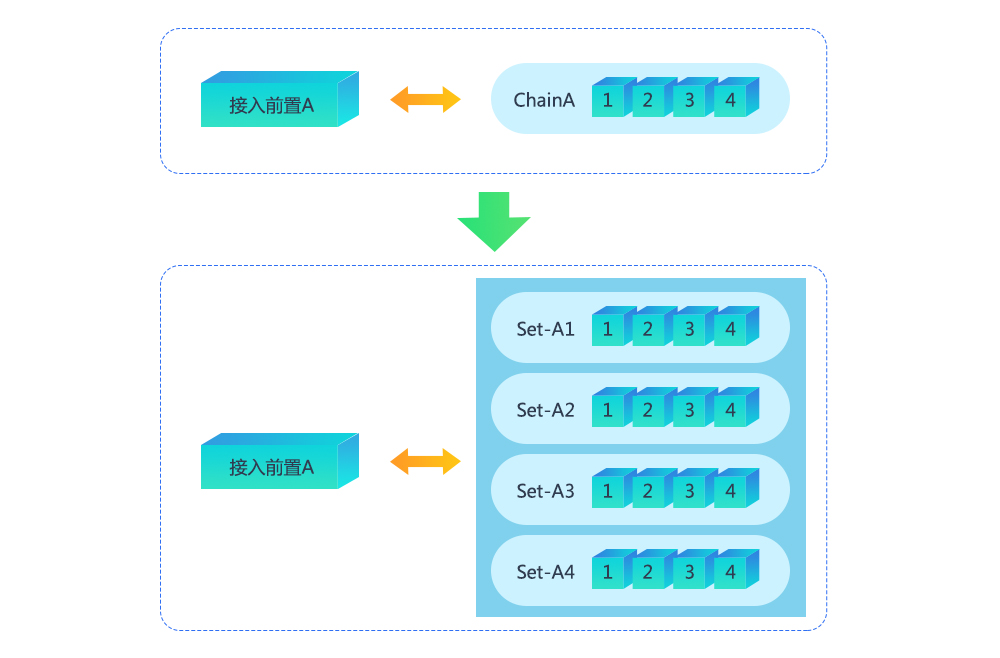
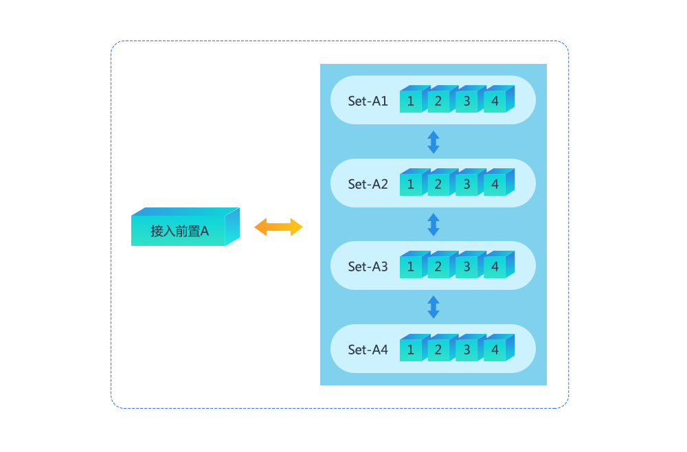
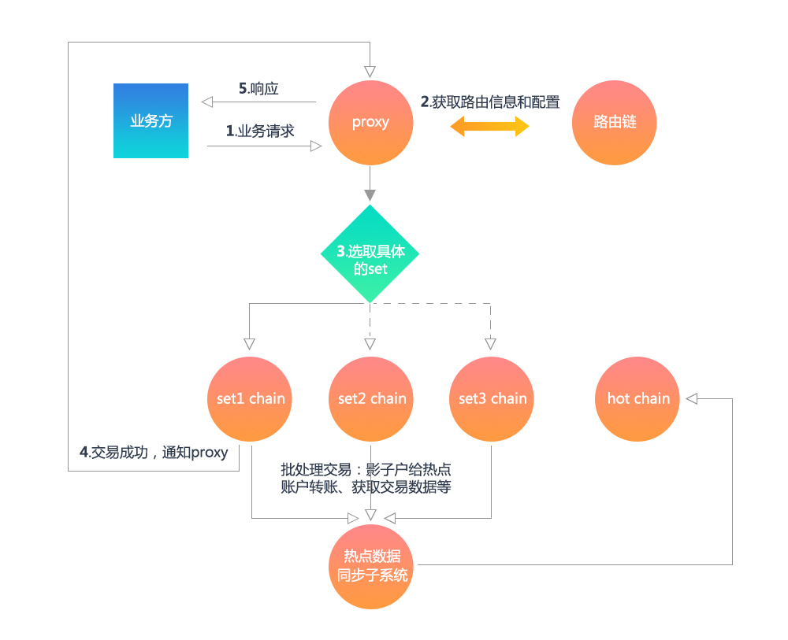

# 并行计算和热点账户解决方案
**作者：fisco-dev**  
在研究和实现区块链平台和进行业务落地的过程中，我们意识到，区块链的运行速度会受多种因素影响，包括加密解密计算、交易广播和排序、共识算法多阶段提交的协作开销、虚拟机执行速度等，以及受CPU核数主频、磁盘IO、网络带宽等硬件性能影响。由于区块链是先天的跨网络的分布式协作系统，而且强调安全性、可用性、容错性、一致性、事务性，用较复杂的算法和繁琐的多参与方协作来获得去信任化、数据不可篡改以及交易可追溯等特出的功能优势，根据分布式的CAP原理，在同等的硬件资源投入的前提下，区块链的性能往往低于中心化的系统，其表现就是并发数不高，交易时延较明显。
我们已经在多个方面对系统运行的全流程进行细致的优化，包括加密解密计算，交易处理流程，共识算法，存储优化等，使我们的区块链平台在单链架构时，运行速度达到了一个较高的性能水准，基本能满足一般的金融业务要求。  
同时我们也意识到，对于用户数、交易量、存量数据较大或可能有显著增长的海量服务场景，对系统提出了更高的容量和扩展性要求，单链架构总是会遇到软件架构或硬件资源方面的瓶颈。  
而区块链的系统特性决定，在区块链中增加节点，只会增强系统的容错性，增加参与者的授信背书等，而不会增加性能，只增加节点不能解决问题，这就需要通过架构上的调整来应对性能挑战，所以，我们提出了“并行计算，多链运行”的方案。  
并行多链的架构基本思路是在一个区块链网络里，存在多个分组，每个组是一个完整的区块链网络，有独立的软件模块，硬件资源，独立完成机构间共识，有独立的数据存储。  
根据可定制的路由规则，参与到区块链网络的所有机构和用户，或者区块链里不同类型的交易，可以接入到不同的分组里，每个分组处理特定的一部分交易，当机构或用户数增加，交易量变大或者交易类型增加，都可以快捷的增加分组，并在路由策略里进行设定，将新增的流量分配到新的分组里。并行多链架构类似数据库的分库分表，或者互联网服务的分SET模型，理论上只要投入足够的资源，则系统能处理的流量没有上限，整个系统具有足够的弹性。  
同时，一个区块链网络里的多个分组秉承逻辑和配置高一致性的原则，在商业规则、运营管理上都使用统一的策略，比如，每个分组上的智能合约是完全相同的，核心配置数据也是相同的，只有分组里的机构、用户以及交易类型有所不同。  
或者，虽然因为分组间功能设计的差异，导致不同分组上的智能合约有所不同，如一些分组是处理用户在线交易，强调低时延性，其他分组处理机构间的对账和清结算，关注批量数据处理，那么部署在这些分组上的智能合约会有所不同，但都会通过所有机构以及区块链的运营委员会共同确认，通过共识算法保证部署实施的一致性，公开性，不可篡改性。    
总之，平台提供了基础的分组的策略和实现、路由模块、并行多链的构建工具等，如何根据业务场景设计不同的分组，如根据机构维度，用户维度还是交易维度，甚至是时间维度等，都可以再进行灵活的设计和操作。  
  

在实现了区块链分组后，分组之间有可能出现互相发生交易的场景，实际上就是不同区块链系统之间的通信和交易，类似“跨链”的架构。在这个环节，需要关注的是分组间的通信可靠性，分布式事务完整性和一致性，以及分组之间可验证、不可篡改、可追溯的互信性和交易安全性。  
   

在此版本，我们根据金融业常见的“热点帐户”场景，提出了一种解决方案。  
在很多金融交易场景里，可能会出现大量的独立用户帐户和少数集中的一个或多个热点帐户产生交易的情况，如用户往某个热卖中的商户付款，或者用户频繁从某个帐户中提现或者获取优惠券、积分或者其他资产等，由于用户帐户数量较大, 相对来说，这些被集中访问的商户帐户，就被称为“热点帐户”。热点帐户在完成和用户的交易之外，还需要汇总所有的交易结果，计算总分帐，余额等，以便完成其特有的商业流程，如清结算等。  
    

由于针对热点账户的交易量较大且所有用户都可能和它发生交易，我们考虑设计多个并行的交易链，首先将用户按照一定的性能模型分组，每个针对用户的分组而构建的独立的区块链组件，我们称为“用户交易链”。举例：预估为每个分组100万用户，5个分组能容纳500万用户（实际的每组能容纳的用户数需要根据业务场景实测评估），这样我们构建了5个“用户交易链”。  
然后，热点帐户本身可以集中在一个热点账户的链上（也可以分配在某一个分组里），热点账户链主要用于准实时的汇总各“用户交易链”的账务，以管理热点账户的总分帐，如总收入，总支出，帐户准实时余额等。  
为了支持用户和热点账户的交易，热点帐户在每个“用户交易链”上，都会设立一个影子户，用户在实时交易时，实际上是和“用户交易链”内的热点帐户影子户发生交易，每次交易都在用户交易链内部进行共识，不同的分组可以并行的进行交易计算，互不相关，用户和影子户之间的交易完成后，即意味着用户和热点帐户的交易完成。系统的容量和用户交易链的个数有关，用户交易链越多，系统容量越大，用户体验得到了保障。    
在用户交易链上，热点帐户影子户里只保存该分组里的总分帐，即一部分用户进行交易后，影子户里产生的收入、支出等，用户交易链会定期构建一次链内账目清算交易，并向热点帐户链发起一次跨链汇总交易，热点帐户链接收到交易之后，会到用户交易链去验证交易发送者的身份、汇总交易的存在性、账目的真实性和准确性，验证成功后，在热点帐户链上继续进行账目计算和入账操作，流程结束。  
整个过程会通过链间的中继，进行多次双向通信，且在不同的链上完整的执行共识确认。用户和影子户的交易可在一次共识的时间段内完成，时延较短，以满足用户体验。热点账户的总分帐计算为准实时完成，其时延取决于定时发起汇总交易的间隔，以及用户交易链和热点帐户链的共识时间。系统会保证用户交易链和热点帐户链之间的交易不错、不乱、不漏，具备事务一致性和完整性。  
并行多链计算是一个基础的系统扩展方案，热点帐户的解决方案是一个场景性的实现，充分理解并行多链计算和跨链交易的实现后，可以针对有海量需求的各种金融交易场景，设计出不同的方案来，以解决具体的场景问题。  
