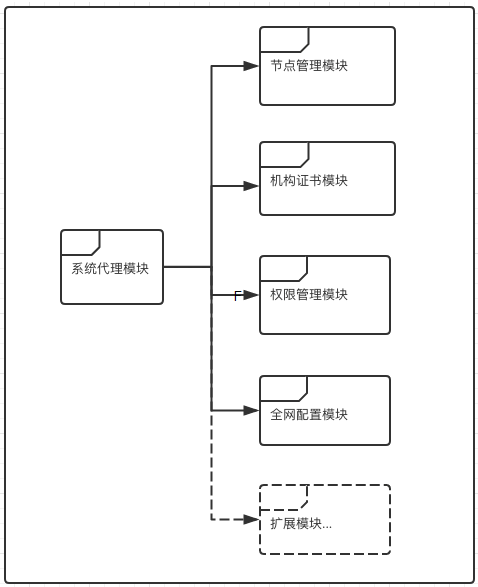

# FISCO BCOS系统合约介绍
**作者：fisco-dev**  

<!-- TOC -->

- [FISCO BCOS系统合约介绍](#FISCO BCOS系统合约介绍)
    - [设计概述](#设计概述)
    - [实现概述](#实现概述)
        - [系统代理合约](#系统代理合约)
        - [节点管理合约](#节点管理合约)
        - [机构证书合约](#机构证书合约)
        - [权限管理合约](#权限管理合约)
        - [全网配置合约](#全网配置合约)
    - [自定义扩展](#自定义扩展)
        - [示例1-自定义业务配置合约](#示例1-自定义业务配置合约)
        - [示例2-自定义业务权限Filter合约](#示例2-自定义业务权限filter合约)

<!-- /TOC -->

## 设计概述

FISCO BCOS区块链为了满足准入控制、身份认证、配置管理、权限管理等需求，在网络启动之初，会部署一套功能强大、结构灵活且支持自定义扩展的智能合约，统称系统合约。

系统合约原则上由区块链管理员在网络启动之初部署全网生效。若是在网络运行期间重新部署变更升级，则需要在全网所有节点许可的情况下由区块链管理员来执行操作。

当前FISCO BCOS系统合约主要有五个模块，系统代理模块、节点管理模块、机构证书模块、权限管理模块、全网配置模块。系统合约的模块可以根据需要自定义扩展，它既可以供区块链核心调用也可以对DAPP提供服务。每个模块由一个或多个智能合约来实现。模块结构图如下：



## 实现概述

当前FISCO BCOS对系统代理模块、节点管理模块、机构证书模块、权限管理模块、全网配置模块都做了对应的合约实现。合约源代码目录为systemcontractv2/。下面依次介绍各个合约实现的接口与逻辑。

### 系统代理合约

SystemProxy.sol是系统代理模块的实现合约。它实现了路由到合约地址的命名服务，提供了系统合约的统一入口。内部实现中是通过mapping类型成员变量_routes来维护所有的路由表信息。路由表信息项的数据结构主要是：

```
struct SystemContract {
        address _addr;		#合约地址
        bool _cache;		#缓存标志位
        uint _blocknumber;	#生效区块高度
    }	
```

主要接口如下：

| 接口       | 输入参数                                     | 输出参数                                   | 说明                   |
| -------- | :--------------------------------------- | -------------------------------------- | -------------------- |
| getRoute | string key#路由名称                          | address, bool,uint # 合约地址，缓存标志位，生效区块高度 | 获取路由信息               |
| setRoute | string key, address addr, bool cache# 路由名称，合约地址，缓存标志位，生效区块高度 | 无                                      | 设置路由信息，若该路由名称已存在，则覆盖 |


### 节点管理合约

NodeAction.sol是节点管理模块的实现合约。它实现了对网络中所有节点列表信息的登记、管理、维护功能。每当网络中有节点加入或退出都必须与节点管理合约进行交互。

在FISCO BCOS中节点分为三种类型：核心节点、全节点、轻节点。

```
enum NodeType{
        None,
        Core,   //核心 
        Full,   //全节点 
        Light   //轻节点 
    }
```

节点信息的数据结构是：

```
struct NodeInfo{
        string		id;   		#节点身份ID    
        string		ip;     	#机器IP       
        uint		port;		#机器端口
        NodeType    category;	#节点类型
        string		desc;    	#节点描述 
        string		CAhash;  	#节点机构证书哈希
        string		agencyinfo; #节点其他信息
        uint		idx;		#节点序号
        uint		blocknumber;#区块高度
    }
```

主要接口如下：

| 接口           | 输入参数                                     | 输出参数       | 说明                  |
| ------------ | :--------------------------------------- | ---------- | ------------------- |
| registerNode | string _id,string _ip,uint _port,NodeType _category,string _desc,string _CAhash,string _agencyinfo,uint _idx #节点身份ID、IP、端口、节点类型、节点描述、节点CA哈希、节点agency、节点序号 | bool #注册结果 | 注册节点 ，若该节点信息已存在，则忽略 |
| cancelNode   | string _id #节点身份ID                       | bool #注册结果 | 注销节点，若该节点信息不存在，则忽略  |


### 机构证书合约

CAAction.sol是机构证书模块的实现合约。它实现了对网络中所有节点的机构证书信息的登记、管理、维护功能。当网络启用机构证书验证功能的情况下，网络中节点加入或退出都需要与机构证书合约进行交互。

机构证书的数据结构是：

```
struct CaInfo{
        string  hash;		#节点机构证书哈希
        string pubkey;		#证书公钥
        string orgname;		#机构名称
        uint notbefore;		#证书启用日期
        uint notafter;		#证书失效时间
        CaStatus status;	#证书状态
        string    whitelist;#IP白名单
        string    blacklist;#IP黑名单
        uint    blocknumber;#生效区块高度
      }
```

主要接口如下：

| 接口     | 输入参数                                     | 输出参数                                     | 说明                        |
| ------ | ---------------------------------------- | ---------------------------------------- | ------------------------- |
| update | string _hash,string _pubkey,string _orgname,uint _notbefore,uint _notafter,CaStatus _status,string _whitelist,string _blacklist # 证书哈希、证书公钥、机构名称、 证书启用日期、 证书失效时间、证书状态、IP白名单、IP黑名单 | bool #更新结果                               | 更新证书信息， 若该证书信息不存在，则新建证书记录 |
| get    | string _hash#证书哈希                        | string,string,string,uint,uint,CaStatus,uint#  证书哈希、证书公钥、机构名称、证书启用日期、证书失效时间、证书状态、生效区块块号 | 查询证书信息                    |


### 权限管理合约

FISCO BCOS基于角色的身份权限设计有三要点：一个外部账户只属于一个角色；一个角色拥有一个权限项列表； 一个权限项由合约地址加上合约接口来唯一标识。

当前FISCO BCOS权限管理模块主要由TransactionFilterChain.sol、TransactionFilterBase.sol、AuthorityFilter.sol、Group.sol四个合约来实现。

TransactionFilterChain是对Filter模型的实现框架。它在内部维护了一个实现继承于TransactionFilterBase的Filter合约地址列表。它对区块链核心提供了统一的权限检查接口process。process执行过程中会对Filter合约地址列表中的所有Filter依次执行process函数，以完成所有需要的权限检查。

TransactionFilterBase是Filter的基类合约。所有Filter必须要实现它的process接口。AuthorityFilter是继承于TransactionFilterBase的角色权限Filter实现。它的process接口实现了对用户所属角色组的权限项进行检查逻辑。

Group是对角色的实现。它内部维护了该角色的所有权限项的mapping标志位。

主要接口如下：

| 合约                    | 接口            | 输入参数                                     | 输出参数      | 说明      |
| --------------------- | ------------- | ---------------------------------------- | --------- | ------- |
| TransactionFilterBase | process       | address origin, address from, address to, string func, string input# 用户外部账户、交易发起账户、合约地址、合约接口、交易输入数据 | bool#处理结果 | 权限检查    |
| Group                 | setPermission | address to, string func, bool perrmission# 合约地址、合约接口、权限标记 | bool#处理结果 | 设置角色权限项 |


### 全网配置合约

ConfigAction.sol是全网配置模块的实现合约。它维护了FISCO BCOS区块链中全网运行的可配置信息。 配置信息可以通过交易广播上链来达到全网配置的一致性更新。原则上只能由区块链管理员来发出全网配置更新交易。

ConfigAction.sol的内部实现中维护了配置项信息的mapping 成员变量。

主要接口如下：

| 接口   | 输入参数                              | 输出参数                     | 说明    |
| ---- | --------------------------------- | ------------------------ | ----- |
| set  | string key, string value# 配置项、配置值 | 无                        | 设置配置项 |
| get  | string key #配置项                   | string, uint# 配置值、生效区块高度 | 查询配置值 |

当前FISCO BCOS主要有以下全网配置项：

| 配置项                  | 说明                           | 默认值       | 推荐值         |
| -------------------- | ---------------------------- | --------- | ----------- |
| maxBlockHeadGas      | 块最大GAS （16进制）                | 200000000 | 20000000000 |
| intervalBlockTime    | 块间隔(ms) （16进制）               | 1000      | 1000        |
| maxBlockTranscations | 块最大交易数（16进制）                 | 1000      | 1000        |
| maxNonceCheckBlock   | 交易nonce检查最大块范围（16进制）         | 1000      | 1000        |
| maxBlockLimit        | blockLimit超过当前块号的偏移最大值（16进制） | 1000      | 1000        |
| maxTranscationGas    | 交易的最大gas（16进制）               | 20000000  | 20000000    |
| CAVerify             | CA验证开关                       | FALSE     | FALSE       |

## 自定义扩展

### 示例1-自定义业务配置合约

假设业务需要利用系统合约框架，自定义业务配置合约以对业务相关合约提供配置服务。大体可以参考以下步骤来扩展：

1. 根据业务合约需求，实现业务配置合约的设置配置项接口set和查询配置值接口get。
2. 部署业务配置合约，获得业务配置合约链上地址。
3. 调用系统代理合约SystemProxy的setRoute接口，将业务配置合约地址注册到路由表中。
4. 至此，业务配置合约已经完成在系统代理合约的路由注册，已可在业务交易中调用。

业务配置合约的使用方法：

1. 调用SystemProxy的getRoute接口运行时获得业务配置合约地址。
2. 通过业务配置合约地址调用查询配置值接口get获得配置值。

### 示例2-自定义业务权限Filter合约

假设业务需要增加业务权限校验逻辑，则可以利用权限管理合约的Filter机制来无缝扩展。大体可以参考以下步骤来扩展：

1. 继承于TransactionFilterBase实现一个业务权限Filter合约，业务权限Filter合约根据业务需要的权限校验逻辑实现process接口。
2. 部署业务权限Filter合约，获得对应的合约地址。
3. 调用系统代理合约SystemProxy的getRoute接口，获得TransactionFilterChain合约地址。
4. 调用TransactionFilterChain合约的addFilter接口，将业务权限Filter合约地址注册到Filter合约列表中。
5. 至此，业务权限Filter合约已经启用。


