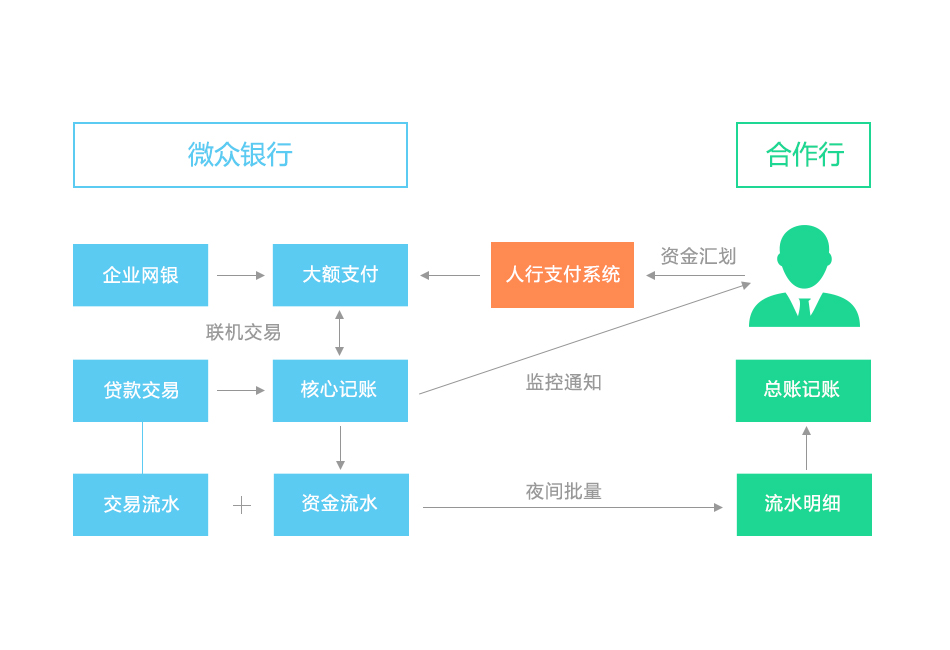
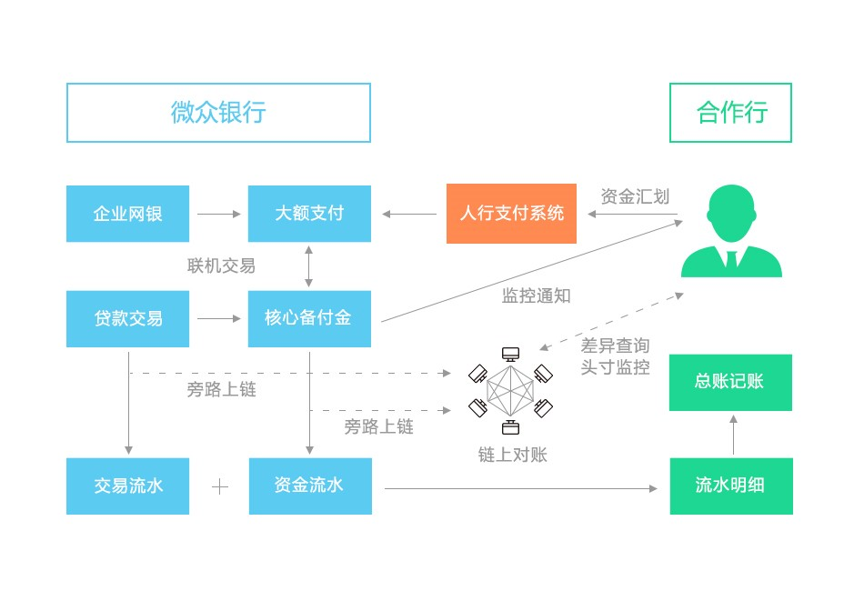

## **微粒贷机构间对账平台**
**作者：fisco-dev**  

### **背景概述**

2016年8月，微众银行联合合作行，基于BCOS早期版本推出了微粒贷机构间对账平台，这也是国内首个在生产环境中运行的银行业联盟链应用场景。

 

目前有多家合作行相继接入微粒贷机构间对账平台，通过区块链与分布式账本技术，优化微粒贷业务中的机构间对账流程，实现了准实时对账、提高运营效率、降低运营成本等目标。截止目前，平台稳定运行1年多，保持0故障，记录的真实交易笔数已达千万量级。

** **

### **批量文件对账**

微粒贷是微众银行面向微信用户和手机QQ用户推出的首款互联网小额信贷产品，为超过千万的用户提供便捷、高效的贷款服务。微粒贷与其他银行存在较为普遍的同业合作，在该合作模式下，合作银行之间的资金清算显得极为重要。

 

金融业务合作不同于一般合作，需要频繁地进行数据交换及对账等繁杂工作，因此“对账”是金融机构之间最普遍的需求之一，对账目的时效性和准确度要求尤为苛刻。传统的对账方式是“批量文件对账”：即机构之间会约定好某一个时间点对前一个交易日的所有数据进行汇总，按照约定格式输出成文件，并以某一种技术手段交付给其他机构进行对账。

                            

在这种“批量文件对账”方式下，存在着一些痛点，如：

•      合作行无法实时了解到引发账户变动的贷款借还交易明细信息。

•      合作行无法及时了解到账务是否不平。

•      合作行需要自己开发对账系统。

•      缺乏统一全面的信息视图。

** **

### **区块链对账方案**

区块链技术是一种不可篡改的分布式账本技术，区块链技术最大的特征是“分布式账本”，即链上的各个参与机构共同拥有一个账本。区块链上所有的交易信息都会被记录，并且无法篡改，可确保数据的真实透明可追溯，非常适用于金融行业的交易数据同步和对账等场景。传统“批量文件对账”模式长久以来未能解决的问题，正是区块链技术的用武之地。微众银行基于此特征，设计了区块链对账方案，利用区块链技术将交易信息旁路上链，解决微粒贷业务系统与合作行的对账问题，降低了合作行的人力和时间成本，提升了对账的时效性与准确度。

设计原则：

•      不影响现有业务，通过旁路上链的方式，将业务数据脱敏后发送到区块链上。

•      开发一个web系统，方便合作行查询区块链上的对账结果。

•      业务数据传输、存储均采用加密方式，确保数据安全性。

 

具体而言，基于区块链技术实现的微粒贷机构间对账平台具有以下优势：

•      使用简单：通过内网访问web系统，输入管理员账号密码即可登录。

•      数据实时触达：实时监测当日账户余额、当日放款总金额、当日还款总金额、当日其它划入款项总金额、当日其它划出款项总金额和当日流水数据。

•      数据安全性高：数据的通信和存储都经过加密处理。

•      数据可用性高：区块链节点之间相互同步数据，提升数据的可用性。

•      合作行可控性强：合作行可以自由选择自己的节点数为1到多个，节点可以选择部署在合作行内或公有云上，不同合作行之间的数据是物理隔离，保护隐私。

 

如果您觉得本文不错，欢迎[戳这里](https://github.com/FISCO-BCOS/FISCO-BCOS)给FISCO BCOS打star:star:。
