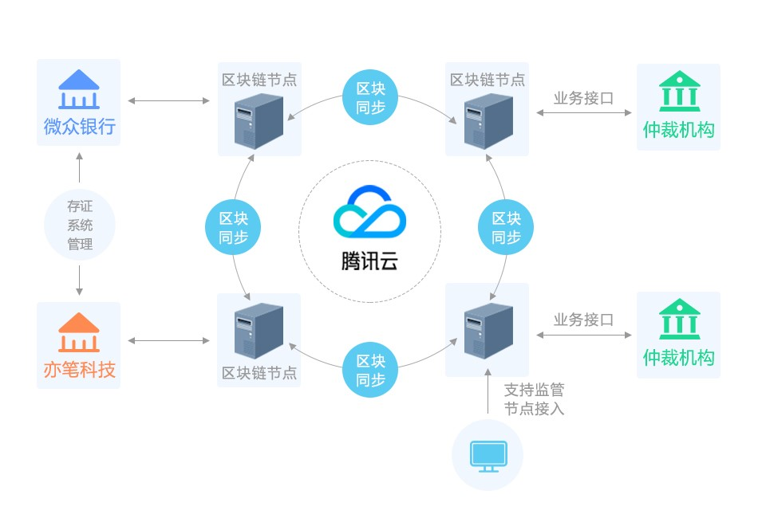
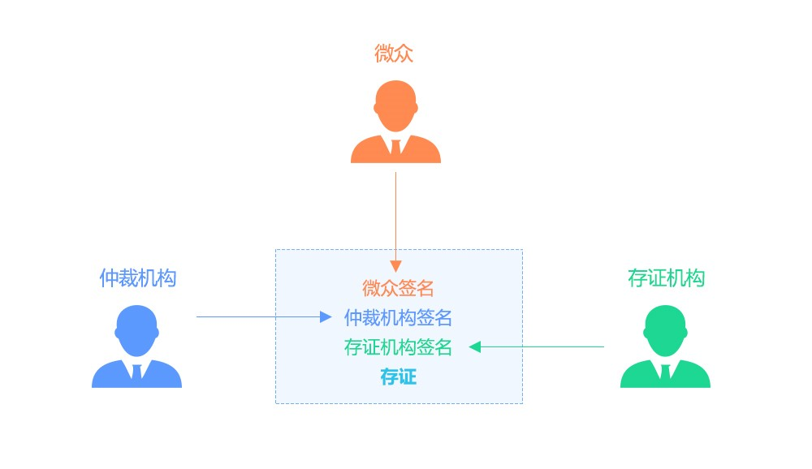

## **“仲裁链”：基于区块链的存证实践**

作者：fisco-dev

** **

### **背景概述**

2017年10月，微众银行联合广州仲裁委（即下文“仲裁机构”）、杭州亦笔科技（即下文“存证机构”）三方基于区块链技术搭建了“仲裁链”。“仲裁链”基于区块链多中心化、防篡改、可信任特征，利用分布式数据存储、加密算法等技术对交易数据共识签名后上链，实时保全的数据通过智能合约形成证据链，满足证据真实性、合法性、关联性的要求，实现证据及审判的标准化。

2018年2月，广州仲裁委基于“仲裁链”出具了业内首个裁决书。

截止目前，“仲裁链”已经稳定运行5个多月。

 

 

### **平台价值**

“仲裁链”接入仲裁机构，让仲裁机构参与到存证业务过程中来，一起共识、实时见证，为仲裁提供了真实透明可追溯的业务数据源。这对于仲裁机构来说，保证了链上交易信息不被篡改，有助于仲裁机构快速完成证据的核实、解决纠纷，降低仲裁过程中人力物力和时间成本，提升司法效率，降低仲裁成本；对于金融机构来说，”仲裁链”将快速有效解决纠纷，提高运营和风控效率；对于用户来说，”仲裁链”在保障合法权益的同时，能够有效保护隐私，降低解决纠纷的时间和经济成本。

 
 
 
 
 

### **平台功能**

线上仲裁存证主要包括存证、取证，核证三部分：

在发起存证前，需部署存证初始条件智能合约，约定存证生效所需条件（在这里就是微众，仲裁机构，存证机构的签名）。

1）存证：业务数据经微众存证系统签名后发起上链，上链成功后通知存证机构及仲裁机构对数据签名确认。存证机构及仲裁机构收到通知后，取出链上数据进行核实后完成签名，至此整个存证流程完成。在整个存证流程中，由智能合约保证，任何方都不能更改已存证的数据，只能追加存证数据。同时，存证系统准实时异步上链，对正常的业务逻辑无影响。

2） 取证：当有取证需求时，微众银行从”仲裁链”选择数据后，提交仲裁机构。仲裁机构对微众银行提供的数据进行解析，获取到区块链相关地址信息。通过地址调取链上数据。

3） 核证：区块链核证指的是仲裁机构在取证后，调用SDK相关接口，判断存证是否满足存证生效的初始条件。

 

                          

图1：”仲裁链”业务架构图

 
 
 
 
 
 

### **存证样例**

为帮助开发者在存证场景中快速启动存证应用开发，FISCO BCOS还提供了完整的存证样例供开发者学习和使用，包括完整的业务sdk代码和详细的说明文档。适用于所有需要进行存证、核证、取证的业务场景，尤其是需要解决多方信任问题或获取司法监管许可的情况。

 

FISCOBCOS存证样例演示的业务流程如下：

1)      存证参与各方需要事先约定存证生效所需条件，然后由一方调用SDK API新建、部署工厂合约，大家共识通过生效。

2)      存证业务方通过SDK API调用工厂合约新建附加了自己签名的证据合约。（需要传工厂合约的地址文件。）

3)      存证机构调用SDK API对证据进行签名确认。

4)      仲裁机构调用SDK API对证据进行签名确认。

5)      仲裁机构通过SDK API调取链上证据信息，并验证证据已有的签名正确性和完整性。

图2：存证样例流程示意图

 

存证样例为开发者提供了大量的默认配置，大大降低了用户自主配置的成本。使用一键脚本，只需配置节点ip和端口，就可以直接运行整个存证流程。样例同时配备了详细的文档说明，给用户提供stepby step的使用指导，协助用户直观快速地理解系统。在此基础上，带来多种体验方式，既可以整体一键式快速体验整个存证流程，也可单步详细分析每个步骤。

 

附：

存证样例地址：

https://github.com/FISCO-BCOS/evidenceSample

如果您觉得本文不错，欢迎[戳这里](https://github.com/FISCO-BCOS/FISCO-BCOS)给FISCO BCOS打star:star:。
