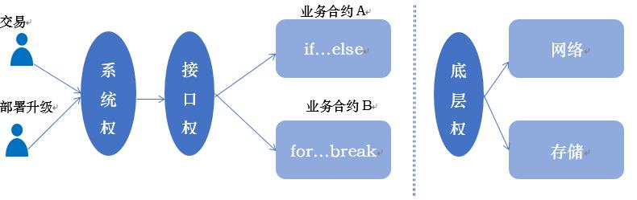

# WIKI 联盟链的权限体系
**作者：fisco-dev**  

区块链从诞生开始，通常被认为是个“开放”、“自由”的世界，可以自由加入、自由交易、自由检索、自由退出，“权限”和“控制”相关的理念讲的是比较少的。  

比特币和以太坊这两个典型的公链平台，虽然整个生态非常庞大，但在线上系统里并没有很明显的角色划分，大家都可以采用自己的区块链客户端或钱包来参与交易，也都可以成为矿工（能不能挖到矿就另说了），资产的归属和交易主要通过公私钥机制来控制，掌握了私钥就可以操作这个用户名下所有资产，也可以结合多签名等机制，对资产进行更精细的控制。

在准入许可的联盟链里，做为一个企业级的软件体系，对参与到链的活动的人也需要精细管理。原因如下： 

1. 联盟链承载的业务复杂度可能超越数字资产转让，即使是同一个商业场景里的不同业务流程，能参与和应该参与的人也可能不一样；
2. 基于商业的上的隐私和安全考虑，要求对不同的人能做的操作、和能访问的范围进行区别对待；
3. 企业级生产环境对稳定性要求很高，运维升级操作特别谨慎，根据DO分离的基本思想，开发和运维的活动需要分开，再进一步：参与交易的，负责运营的，需要各司其职；
4. 可能有监管、委员会、治理人员等特殊身份存在，需要为这些特殊身份定制不一样的操作能力，这些能力不能赋予普通用户使用。

以上是必要性。简单总结下目前的做法是：

在支持智能合约的区块链平台里，可以控制某个用户以下行为:  
1. 能否部署合约。杜绝没有被审核过的合约发布到链上和被执行。  
2. 能否调用某个合约。合约代表了一些系统能力或业务流程，如果不能调用某个合约的某个接口，那么这个用户就无法实现系统配置，系统控制，或者参与智能合约实现的业务交易流程。

-----------------以下是详细解析的分割线，有兴趣可以往下--------------------------

角色和权限总体来说是和场景强相关的，目前也没有非常标准化的实现。做为业务规则制定者和系统建设者，在做系统分析，需求分析时，就有必要对场景进行详细的分解，采用合适的设计模式，搞清楚系统的5W1H，在这个基础上进行角色和权限的规划。

- **WHO** ： 都会有哪些人来使用系统，如普通用户、柜员、收单机构、发卡机构、清算机构、监管者等；
- **WHY** ： 每个人来这个系统的目的是什么。如用户就是为了消费，柜员服务于用户，监管检视数据和进行必要的控制，机构开展业务的同时要维护系统稳定；
- **WHAT**： 每个人都会操作什么系统、资产、工具。如用户要用APP,看余额、要花钱、要提现，机构要有管理工具、运维工具、要开发和发布执行交易的智能合约、要清结算拿到钱款，监管机构要有大数据平台、报表或者监管工具；
- **WHEN**： 这些人什么时候会有一些动作。比如用户每天都会消费，机构的运维人员会定期升级和维护程序，不定期处理告警，清算机构在场切日切后要做清算，监管者可以选择是否实时介入交易，或者仅定期巡检，或在有问题时强势介入；
- **WHERE**： 活动场合或场所。用户通过APP随时随地在合作商户消费，APP通过机构提供的接口来发送交易，程序员在开发网开发编译，运维在IDC或ECC直接对区块链进行发布和调整，运营配置人员通过管理台或者管理工具直接或者通过远程接口进行运营数据的配置，监管机构远程调控，通过接口或者发个邮件过来指定控制措施；
- **HOW**：根据以上的5W，要梳理出都有哪些控制点、功能接口、管理流程，在每个场景，怎么一步一步的，通过什么工具什么操作指令，或者设定哪些联机检查规则去做到权限控制。形成详细设计，理清是否有技术或者其他障碍，然后分配到各模块去进行开发、部署。

这里列出几种最常见的角色， 作为角色和对应活动权限的示例，非完整的角色体系定义。
  

- **交易操作员**:使用平台进行商业交易操作的人员，交易操作员发起业务的交易，如发行、售卖、转账、消费、付款等（根据不同的业务场景，有不同的操作），并查询交易执行结果。不同的交易操作员，也可以再细分角色。  
- **平台运营管理者**:通常由联盟链管理委员会，或公选出来的运营人员承担，负责审核、修改、删除链上的节点和帐号相关资料。如设定某一个联盟链的信息和进行初始化部署，组织各机构加入联盟链，为各机构分配对应的机构管理员和交易员权限，管理链上应用的生命周期等。平台运营管理者对联盟链的日常运营负责，一般不直接参与链上业务交易。
- **应用开发者**:使用平台提供的源代码，SDK、接口以及平台环境，开发面向用户的商业应用。应用开发将可发行的软件提交应用到平台的应用仓库，包括智能合约、APP等。在DO分离的管理模式中，开发者一般不直接对联盟链直接操作，而由运维管理者进行软件发布、参数配置等操作。为了跟踪应用的使用情况，开发者有查看相关应用的统计数据的权限。
- **运维管理者**:实施联盟链的部署和运维活动的人员。通常为各机构的运维团队承担，或者由平台运营管理者统一组织运维管理，运维人员负责发布和管理应用，管理区块链的节点物理资源，启停节点服务，修改本地节点的系统配置参数，一般不会参与业务交易。
- **监管方**：制定业务规范，审查业务数据，监督管理联盟链的运行状态，维护服务的合法、稳健运行。监管方一般不参与联盟链的日常运作管理，根据业务场景需要，监管可选择参与到业务交易中。
在不同业务的联盟链上，具体的角色定义和角色的层级关系也会有不同，可由联盟链的运营者进行定义和二次开发。

在角色和帐号模型中，帐号代表一个人或者一个IT系统，使用一个唯一的公私钥对，帐号的持有者要妥善保管私钥，不对外公开，同时把公钥公布出去，用于标识自己，当某个帐号向系统发出请求时，采用私钥进行签名，接受数据的对手方会根据发送者的公钥进行验签。

一个帐号必须对应到且只能对应到一个角色，如某个帐号的角色是“交易员”，则这个帐号不应同时做为“开发者”或“监管者”，避免“**又做运动员又做裁判员**”的可能性，又如帐号已经是“开发者”，则他不应同时是“运维人员”，避免违背“DO分离”的原则，同时他也不应成为“交易员”或“监管者”。  

如果某个机构同时兼顾多个角色的职责，这个机构的人员需要进行交易，又可以做为“运维人员”参与系统维护，那么应给该机构分配多个帐号，每个帐号的私钥掌握在不同的人员手里，每个人员只负责一种角色的工作，以规范操作流程。  

同时，多个帐号可以对应到同一个角色，如一个机构可以有多个交易员帐号，都拥有进行交易的权限，每个交易员在链上的交易都可以根据签名和公钥信息对应到某个特定的交易员，便于机构的交易行为管理和交易结果追溯。同理，可以有多个运维人员、多个运营人员等。   
**面向角色的权限控制，以及合理的帐号分配管理，使对应到不同角色的帐号职责清晰，在链上的活动行为可控，容易追溯。**  

  
a）角色拥有多个权限的集合。  
b）一个帐号只能对应到一个角色。  
c）一个权限对应到某智能合约的一个接口。  
d）帐号只能调用被授权过的智能合约的一个到多个接口。  
 
角色和权限的控制可以实现的非常复杂，如很多MIS系统或者大型的商业化系统里，给人分配角色、分派权限的界面看起来就已经是琳琅满目，可以做出无限深度的关系树，然后有各种交叉错综复杂的权限。

做为一个通用的联盟链平台，在这方面倾向于保持KISS，提供最底层的基础控制接口，把面向业务的角色和权限管理交给业务开发方去定制。

目前抽象出来的权限控制能力有两种模型：

1. **系统级权限模型**：一个角色是否能部署新合约，是否能发起对已有合约的调用，属于系统权限模型。在该角色发起请求后和部署合约或调用合约之前，系统进行判断和控制，拒绝越权的操作。如，如需限制所有的交易员只能向合约发送交易而不能部署新合约，则可以通过系统权限控制实现。

2. **接口权限模型**：作为支持智能合约的区块链平台，平台的诸多功能都是通过智能合约实现的，包括系统配置、权限配置、业务交易等、接口权限模型实现了针对智能合约接口级别的权限控制。当一个新的合约部署生效后，管理员可赋予某个角色调用该合约部分或全部接口的权限。如一个做为会计角色的交易员可以调用某个合约的查询、对账接口，另一个做为实时交易角色的交易员可以调用某个商业合约的消费、转账接口。

有了这两个基础的控制埋点之后，可以针对不同的用户和角色进行配置，精细的限制他们的行为能力。比如发卡行只能调用发卡合约，发卡行不牵涉用户和商户之间的消费流程，收单行只能调用收单的接口，负责用户的消费流程，不能代替用户去充值等等。参与者的多中心化、商业互补性和安全性得以保障。

基于智能合约实现的业务逻辑本身也可以做大量在业务层面上的的权限控制，智能合约能感知是谁（交易的From）在调用自己的某个接口，基于图灵完备的特性，像普通业务逻辑一样去写if...else就可以进行多种多样的控制了。比如控制某个用户或某个机构只能访问和自己相关的订单，不能访问其他人的等等。

更底层一点的权限控制，可以面向区块链的基础数据管理、网络层、存储层起作用，比如，控制某些节点或某些帐号是否能同步区块数据，控制是否能向其他节点广播消息，还是只能默默的从网络接受数据。总而言之，控制无极限，只要在安全和业务上有足够的必要性。

  

如果您觉得本文不错，欢迎[戳这里](https://github.com/FISCO-BCOS/FISCO-BCOS)给FISCO BCOS打star:star:。

