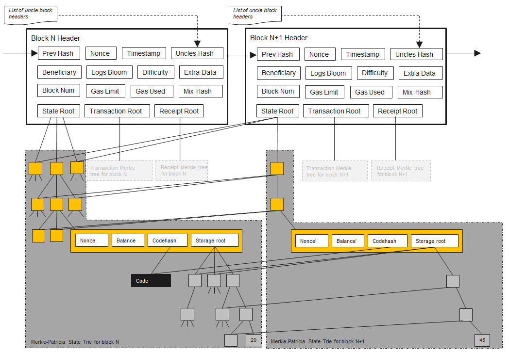
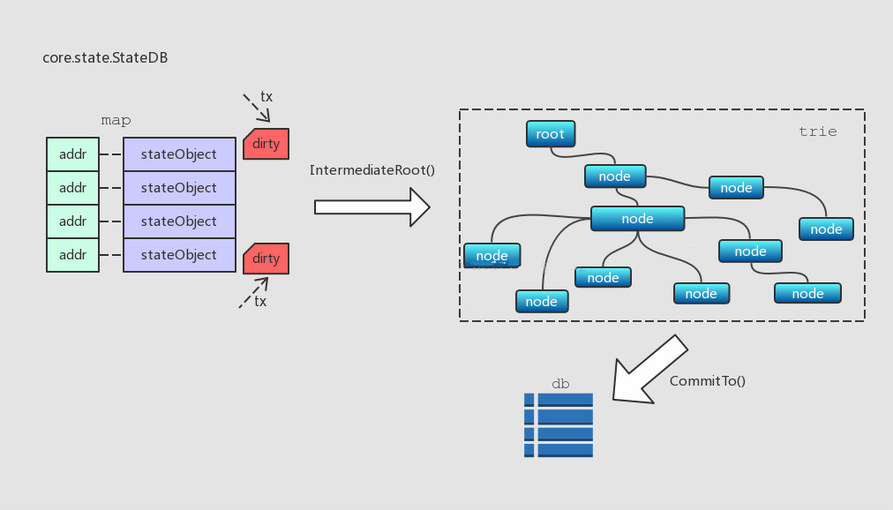
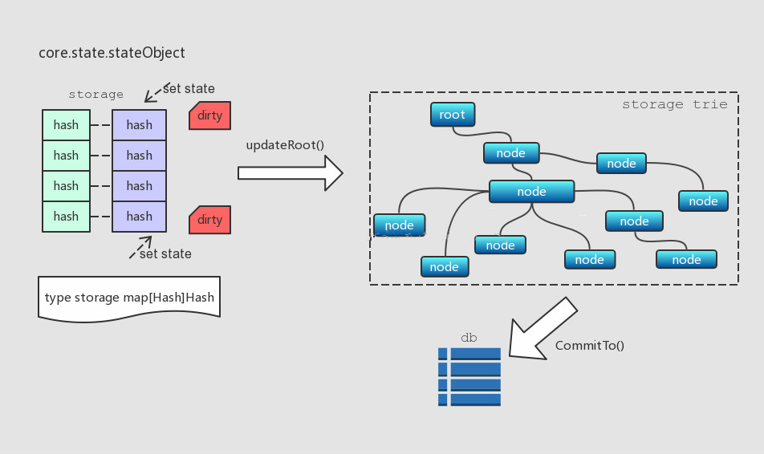

# 浅谈Ethereum的存储
作者：yibi-dev

<!-- TOC -->

- [浅谈Ethereum的存储](#浅谈Ethereum的存储)
    - [概述](#概述)
    - [区块存储](#区块存储)
    - [StateDB模块](#StateDB模块)
    - [存储账户(stateObject)](#存储账户(stateObject))
    - [交易存储](#交易存储)
    - [以太坊智能合约存储方式及执行](#以太坊智能合约存储方式及执行)
    - [以太坊智能合约中的存储](#以太坊智能合约中的存储)


<!-- /TOC -->

## 概述

区块(Block)是以太坊的核心数据结构之一，Block包含Header和Body两部分。区块的存储是由leveldb完成的，leveldb的数据是以键值对存储的。
所有与交易，操作相关的数据，其呈现的集合形式是Block(Header)；如果以Block为单位链接起来，则构成更大粒度的BlockChain(HeaderChain)；若以Block作切割，那么Transaction和Contract就是更小的粒度；所有交易或操作的结果，将以各个个体账户的状态(state)存在，账户的呈现形式是stateObject，所有账户的集合受StateDB管理。

## 区块存储

Ethereum database



以太坊的数据库体系-Merkle-Patricia Trie(MPT)， 它是由一系列节点组成的二叉树，在树底包含了源数据的大量叶子节点， 父节点是两个子节点的Hash值，一直到根节点。
Blockchain和HeaderChain， Blockchain管理所有的Block, 让其组成一个单向链表。Headerchain管理所有的Header,也形成一个单向链表， Headerchain是Blockchain里面的一部，Transaction是Body的重要数据结构，一个交易就是被外部拥有账户生成的加密签名的一段指令，序列化，然后提交给区块链。
保存区块信息时，key一般是与hash相关的，value所保存的数据结构是经过RLP编码的。在存储区块信息时，会将区块头和区块体分开进行存储。因此在区块的结构体中，能够看到Header和Body两个结构体。

区块头（Header）的存储格式为：
```
headerPrefix + num (uint64 big endian) + hash -> rlpEncode(header)
```
key是由区块头的前缀，区块号和区块hash构成。value是区块头的RLP编码。

区块体（Body）的存储格式为：
```
bodyPrefix + num (uint64 big endian) + hash -> rlpEncode(body)
```
key是由区块体前缀，区块号和区块hash构成。value是区块体的RLP编码。

key中的前缀可以用来区分数据的类型，在core/database_util.go中定义了各种前缀：
```
headerPrefix        = []byte("h")   // headerPrefix + num (uint64 big endian) + hash -> header
tdSuffix            = []byte("t")   // headerPrefix + num (uint64 big endian) + hash + tdSuffix -> td
numSuffix           = []byte("n")   // headerPrefix + num (uint64 big endian) + numSuffix -> hash
blockHashPrefix     = []byte("H")   // blockHashPrefix + hash -> num (uint64 big endian)
bodyPrefix          = []byte("b")   // bodyPrefix + num (uint64 big endian) + hash -> block body
```
其中headerPrefix定义了区块头key的前缀为h，bodyPrefix定义了区块体key的前缀为b。

## StateDB模块

在以太坊中，账户的呈现形式是一个stateObject，所有账户受StateDB管理。StateDB中有一个成员叫trie，存储stateObject，每个stateObject有20bytes的地址，可以将其作为key；每次在一个区块的交易开始执行前，trie由一个哈希值(hashNode)恢复出来。另外还有一个map结构，也是存放stateObject，每个stateObject的地址作为map的key。



可见，这个map被用作本地的一级缓存，trie是二级缓存，底层数据库是第三级，各级数据结构的界限非常清晰，这样逐级缓存数据，每一级数据向上一级提交的时机也根据业务需求做了合理的选择。

## 存储账户(stateObject)

每个stateObject对应了一个账户（Account包含了余额，合约发起次数等数据），同时它也包含了一个trie(storage trie)，用来存储State数据。相关信息如下图



stateObject定义了一种类型名为storage的map结构，用来存放[]Hash,Hash]类型的数据对，也就是State数据。当SetState()调用发生时，storage内部State数据被更新，相应标示为"dirty"。之后，待有需要时(比如updateRoot()调用)，那些标为"dirty"的State数据被一起写入storage trie，而storage trie中的所有内容在CommitTo()调用时再一起提交到底层数据库。

## 交易存储

除了区块外，数据库中还存储了所有的交易，交易主要在数据库中仅存储交易的Meta信息，交易Meta存储是以交易hash加交易的Meta前缀为key，Meta的RLP编码为value。
每条交易的存储格式如下：
```
txHash -> rlpEncode(tx)
txHash + txMetaSuffix -> rlpEncode(txMeta)
```
每条交易对应存储两条数据，一条是交易本身，一条是交易的元信息（meta）。交易以交易的hash为key、交易的RLP编码为value存储；元信息以txHash+txMetaSuffix为key、元信息的RLP编码为value存储。元信息中包含交易所在区块的区块hash、区块号、交易在区块中的索引。

## 以太坊智能合约存储方式及执行

智能合约可以简单的理解为一段可执行的程序片段，具体的代码由发布人使用特定的编程语言来编写（以太坊使用的是Solidity编程语言），在本地编译成功后可以发布到区块链上。而以太坊的智能合约也可以理解为一个特殊的交易（包括可执行代码的），被发送出去后会被矿工打包记录在某一个区块中，当需要调用这个智能合约的方法时只需要向这个智能合约的地址发送一笔交易即可。

## 以太坊智能合约中的存储

每个在以太坊虚拟机（EVM）中运行的智能合约的状态都在链上永久地存储着。这个存储可以被认为是每个智能合约都保存着一个非常大的数组，初始化为全0。数组中的每个值都是32字节宽，并且有2^256个这样的值。智能合约可以在任何位置读取或写入数值。这就是存储接口的大小。

智能合约数据存储主要归纳为：
- 每个智能合约都以2^256个32字节值的数组形式存储，全部初始化为零。
- 零没有明确存储，因此将值设置为零会回收该存储。
- Solidity中，确定占内存大小的值从第0号下标开始放。
- Solidity利用存储的稀疏性和散列输出的均匀分布来安全地定位动态大小的值。


