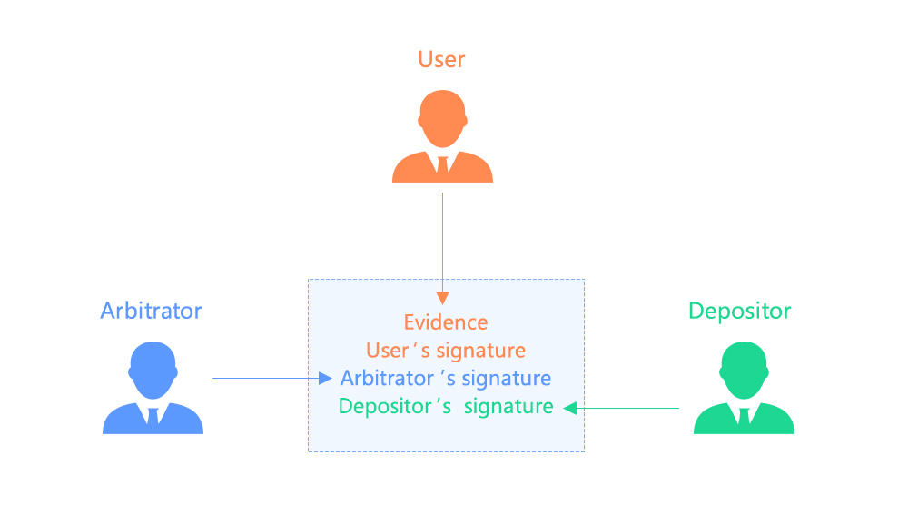
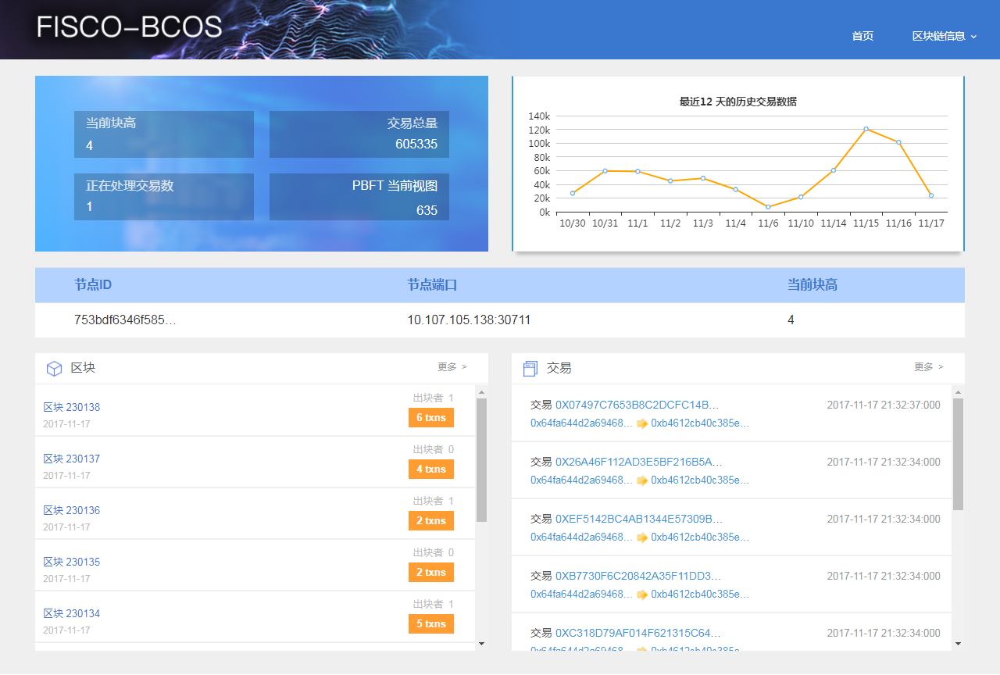
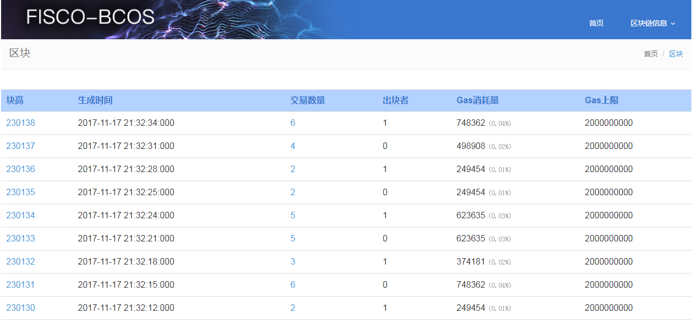
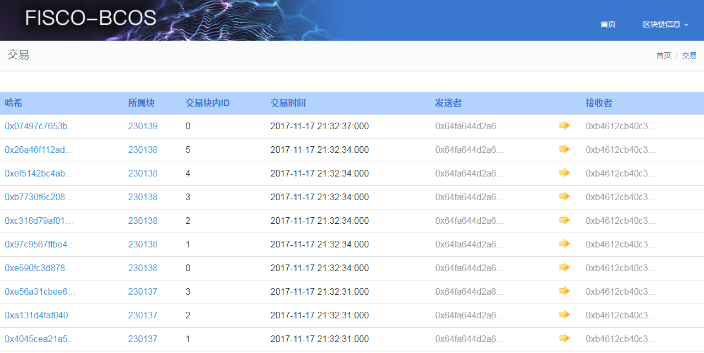

## 浅谈FISCO BCOS的易用性
**作者：fisco-dev** 

FISCO BCOS是聚焦于金融领域的区块链底层平台，期望通过开源来推动生态圈的良好发展。随着开源技术的普及和参与者数量的增加，FISCO BCOS的影响范围将愈发深广，藉此最终构建出开放共赢的区块链生态圈。

开源技术的普及和参与者数量的增加，要求区块链底层平台具备易于使用、可规模化运行的特征。因此FISCO BCOS自设计伊始就十分关注其易用性，在编译部署、开发工具、业务场景案例、以及后续的运维和治理等各个环节，用心设计，并且不断更迭优化、删繁就简，以更好地提升使用者的效率，全面降低应用和治理的成本，同时也让更多对区块链有浓厚兴趣的爱好者也能感受到技术的魅力，参与到区块链的应用体验中。

FISCO BCOS的易用性涵盖了安装部署、代码开发、业务构建、运营运维等方面，在以下5点的表现尤为突出。

### 一键安装脚本

FISCO BCOS支持一键快速安装部署，几条命令就可以运行FISCO BCOS。下载代码后，只需一步，即可完成安装。简单快捷，且成功率高，尤其适合初学者快速体验FISCO BCOS。

一键安装支持两种场景：

 - 1）单机器2节点：即场景涉及两个区块链节点的部署，两个节点都在一台机器上；两个节点相互连接，形成一条由两个节点组成的区块链。部署只需运行shell，执行成功后，即可通过查看进程及日志，判断节点是否运行正常
   
 - 2）两机器4节点：即场景涉及4个区块链节点的部署，其中两个在FISCO BCOS所安装机器本地，两个在另一台机器上；4个节点相互连接，形成一条由4个节点组成的区块链。部署需先生成节点，再分别启动两台机器的节点，随后即可在任一机器上执行shell验证是否正常运行。

一键安装脚本可用于开发和体验环境的构建，如需添加更多节点以组成规模更大的网络，详细安装方法请参考FISCO BCOS使用说明书相关章节。

附：

[一键安装FISCO BCOS脚本使用说明](https://github.com/bcosorg/bcos/wiki/%E4%B8%80%E9%94%AE%E5%BF%AB%E9%80%9F%E5%AE%89%E8%A3%85%E9%83%A8%E7%BD%B2)

[FISCO BCOS使用说明书](https://github.com/bcosorg/bcos/blob/master/doc/manual/manual.md)

### SDK工具

FISCO BCOS平台提供的SDK工具，可同时支持java和node.js两种开发语言。在SDK基础上,开发者可开发面向最终用户的客户端程序，调用链上节点的功能接口，在客户端上即可以访问链上部分或全部的数据，向区块链发起交易。

在SDK的设计上，可直接面向业务，提供业务级别的接口，开发者只需关注业务数据的字段以及调用返回结果，不需要了解区块链节点的具体部署情况，不需要处理异步通信的细节，即可实现业务合约的管理、执行、交易查询功能，在业务sample中会采用这种思路提供SDK。FISCO BCOS同时提供对应的说明文档和使用范例，大幅度降低开发门槛和成本，帮助开发者快速开发各种业务场景的应用。

除了面向业务，SDK还可以直接调用区块链底层功能，开发者需要熟悉区块链节点所提供的底层功能接口，基本数据结构，以及节点的部署情况，SDK则为开发者屏蔽协议编解码以及异步通信，容错等技术细节，减少繁琐的重复工作，提供了极大程度的易用性。

附：
[web3sdk使用指南](https://github.com/FISCO-BCOS/web3sdk)

### Sample

FISCO BCOS提供了sample供开发者学习和使用，以便帮助开发者在对应业务场景下快速启动项目。以存证sample为例，提供了完整的业务sdk代码和详细的说明文档。
存证sample演示了如下4个业务流程：

 - a.新建、部署工厂合约。
 - b.用工厂合约新建证据合约（需要传工厂合约的地址文件）。
 - c.对证据进行签名。
 - d.验证证据已有的签名正确性和完整性。

 

存证sample为开发者提供了大量的默认配置，大大降低了用户自主配置的成本。使用一键脚本，只需配置节点ip和端口，就可以直接运行整个存证流程。sample同时配备了详细的文档说明，给用户提供step by step的使用指导，协助用户直观快速地理解系统。在此基础上，带来多种体验方式，既可以整体一键式快速体验整个存证流程，也可单步详细分析每个步骤。
 
目前FISCO BCOS sample所覆盖的业务场景亦在不断丰富和完善中。

附：
[存证Sample说明](https://github.com/FISCO-BCOS/Wiki/tree/master/%E5%AD%98%E8%AF%81sample%E8%AF%B4%E6%98%8E)

### 区块链浏览器

FISCO BCOS通过区块链浏览器构建了丰富、实时、可视化的数据监控体系，轻松跨越数据监控的技术门槛。在浏览器界面，可以直观清晰地看到FISCO BCOS的内部结构，自动查询区块的历史与实时信息，从而省去开发者自己构造报文从区块链节点的RPC端口查询的繁琐操作，能一目了然的掌握以下信息：
- 节点的ID、端口、块高等信息；
- 区块的块高、时间、交易数量、出块者以及Gas相关信息；
- 交易的Hash、所属块、块内ID、交易时间、发送者、接收者等信息；
- 网络中正在处理的尚未确认的交易信息。 

FISCO BCOS浏览器监控指标亦在持续地完善中，后续还会计划通过浏览器进行链的构建和运营，一旦完成，在前端浏览器上即可实现部署节点启停、合约部署、交易发布、增删节点等操作。这将进一步大大提高易用性。
 

 

同时FISCO BCOS还预埋了监控指标，让开发者只需跟踪查看监控指标输出日志，就能快速获取区块链运行过程中的深层信息，目前日志已覆盖数据库、共识算法、交易和区块四个维度。

浏览器和预埋指标展示数据直观便捷，在满足多个层级的运营分析需求的同时，能大幅度降低应用难度，节省查询统计成本，提升监控效率。

附：
[区块链浏览器说明](https://github.com/FISCO-BCOS/fisco-bcos-browser)

### 运维手册

FISCO BCOS为开发者配备了完善的运维手册，囊括常见错误、升级、管理、治理等模块。区块链系统的运行逻辑具有分布式一致性，不同节点的软硬件配置也基本一致，先天的具备标准化特性，开发者可参照运维手册，自主诊断，快速获取解决方案，使用相应的工具、运维策略和运维流程等对区块链系统进行构建、部署、配置以及故障处理，从而提升反应速度、降低运维成本，最终提升运营效率。

附：
运维手册：（待补充）

以上各层面的易用性，便于各领域的合作伙伴以较低成本快速搭建上层区块链应用，并且持续地高效治理和运营，在推进区块链技术的普及的同时也协助合作伙伴将精力聚焦在业务本身和商业模式的运营上，构建科技和金融深度合作的长效机制，最终达到多方受益，共同打造金融创新的区块链共赢生态。

如果您觉得本文不错，欢迎[戳这里](https://github.com/FISCO-BCOS/FISCO-BCOS)给FISCO BCOS打star:star:。
