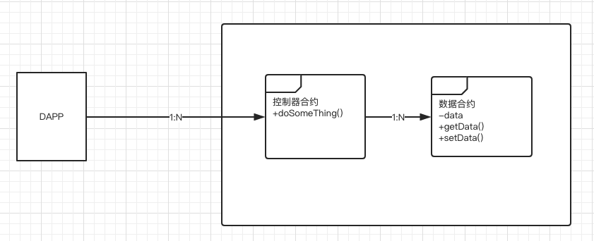
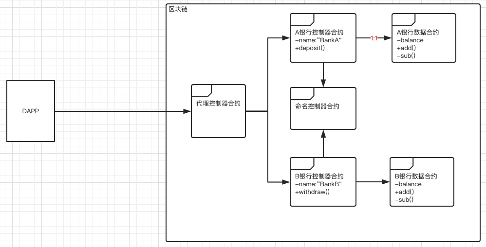
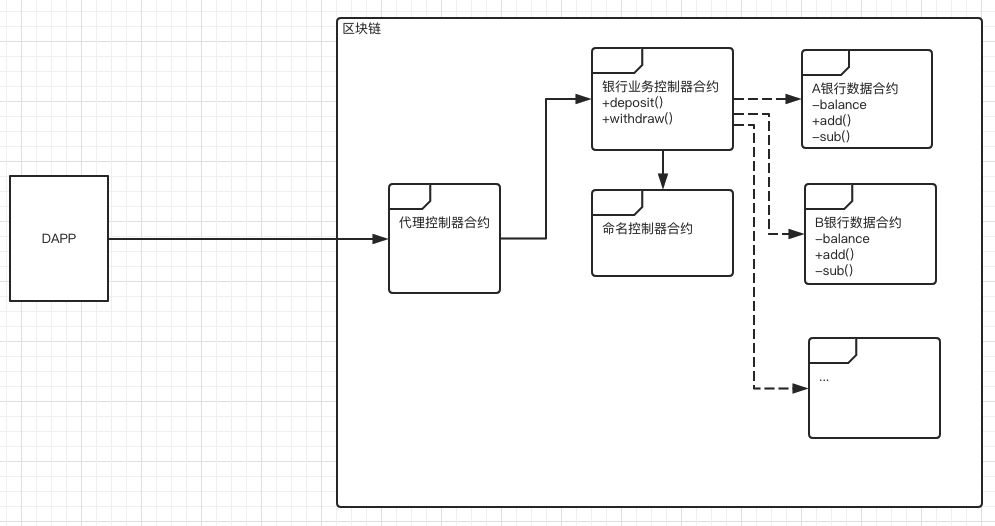
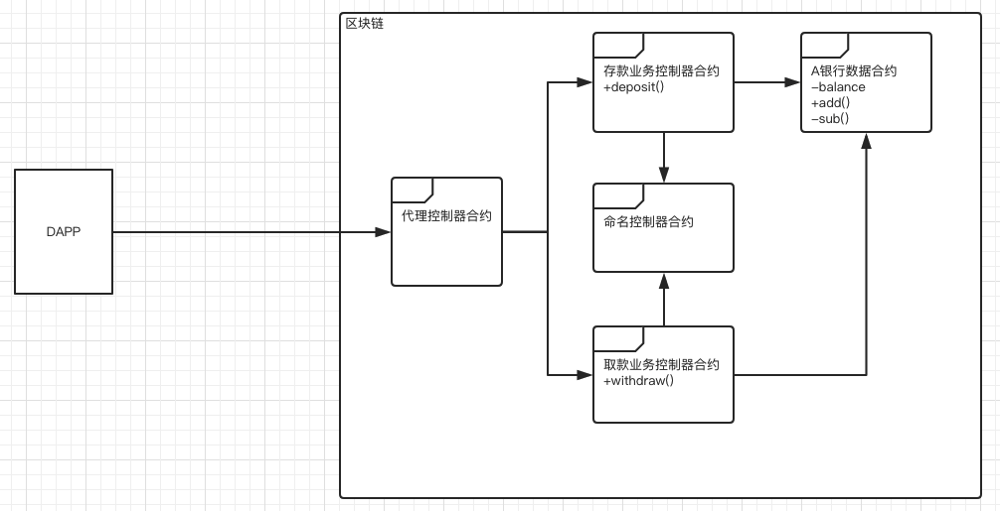
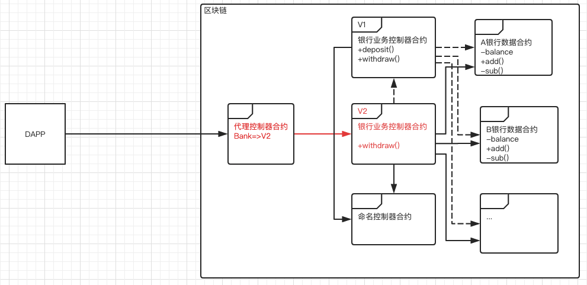
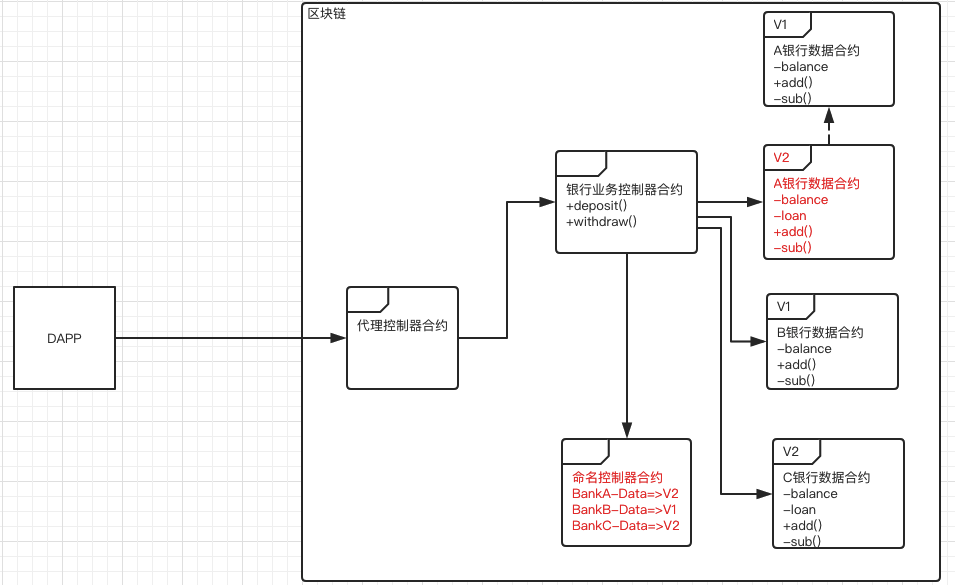

# 浅谈以太坊智能合约的设计模式与升级方法
**作者：fisco-dev**   

<!-- TOC -->

- [浅谈以太坊智能合约的设计模式与升级方法](#浅谈以太坊智能合约的设计模式与升级方法)
    - [1. 最佳实践](#1-最佳实践)
    - [2. 实用设计案例](#2-实用设计案例)
        - [2.1 控制器合约与数据合约: 1->1](#21-控制器合约与数据合约-1-1)
        - [2.2 控制器合约与数据合约:  1->N](#22-控制器合约与数据合约--1-n)
        - [2.3 控制器合约与数据合约:  N->1](#23-控制器合约与数据合约--n-1)
        - [2.4 控制器合约与数据合约:  N->N](#24-控制器合约与数据合约--n-n)
        - [2.5 总结](#25-总结)
    - [3. 升级](#3-升级)
        - [3.1 控制器合约升级，数据合约不升级](#31-控制器合约升级数据合约不升级)
        - [3.2 控制器合约不升级，数据合约升级](#32-控制器合约不升级数据合约升级)
        - [3.3 控制器合约升级，数据合约升级](#33-控制器合约升级数据合约升级)
    - [4. 数据迁移](#4-数据迁移)
        - [4.1 硬编码迁移法](#41-硬编码迁移法)
        - [4.2 硬拷贝迁移法](#42-硬拷贝迁移法)
        - [4.3 默克尔树迁移法](#43-默克尔树迁移法)

<!-- /TOC -->  

以太坊EVM是当前区块链行业应用最为广泛的虚拟机。其所支持的智能合约语言是图灵完备的。该语言支持各种基础类型（Booleans，Integers，Address，String，Enum，Address等)、复杂类型（Struct，Mapping，Array等）、复杂的表达式和控制结构及接口继承等面向对象的特性。

正是由于强大的智能合约语言，原本在真实世界中的复杂商业逻辑和应用都能在区块链上轻松实现。然而需要注意的是，尽管公有链可以实现合理的GAS机制自我保护，联盟链可以用其他机制替代GAS的计算及代币化来保障EVM沙盒安全，但由于区块链运行机制的原因，智能合约的运行即使是异常运行都会在所有区块链节点上独立重复运行。因此，无论是在公有链还是联盟链运行智能合约都是非常昂贵（运算资源、存储资源）的操作。

另外，智能合约与传统应用程序有一个不同的地方在于智能合约一经发布于区块链上就无法篡改，即使智能合约中有Bug需要修复或者业务逻辑变更，它也不能直接在原有的合约上直接修改再重新发布。因此在设计之初就需要结合业务场景考虑合理的升级机制。

总而言之，智能合约实现上要达到的目标是：**完备的业务功能、精悍的代码逻辑、良好的模块抽象、清晰的合约结构、合理的安全检查、完备的升级方案**。

智能合约的生命周期主要有设计、开发、部署、运行、升级、销毁。在下文中主要是基于目标在设计阶段、升级阶段的一些梳理总结。

## 1. 最佳实践

从业务视角来看，智能合约只需要做两件事，其一是如何定义数据的结构和读写方式，其二是如何处理数据并对外提供服务接口。

为了更好的做好模块抽象和合约结构分层，将这两件事分开，既是将业务控制逻辑和数据从合约代码层面就做好分离，这样的处理在复杂业务逻辑场景中经过实践是当前被认为最佳的模式。

这个模式简称为CD（Controller-Data）模式。将合约分为两类：控制器合约（Controller Contract）与数据合约（Data Contract）。

控制器合约通过访问数据合约获得数据，并对数据做逻辑处理，然后写回数据合约。它专注于对数据的逻辑处理和对外提供服务。根据处理逻辑的不同，常见的有命名空间控制器合约、代理控制器合约、业务控制器合约、工厂控制器合约等。一般情况下，控制器合约不需要存储任何数据，它完全依赖外部的输入来决定对数据合约的访问。特殊情况下，控制器合约可以存储某个固定的数据合约的地址或者命名空间（通过命名空间在运行时获得合约地址）。

数据合约专注于数据结构定义与所存储数据的读写裸接口。为了达到数据统一访问管理和数据访问权限控制的目的，最好是将数据读写接口只暴露给对应的控制器合约。禁止其他方式的读写访问。

基于这个模式，遵循从上至下的分析方式，从对外提供的服务接口开始设计各类控制器合约，再逐步过渡到服务接口所需要的数据模型和存储方式，进而设计各类数据合约，可以较为快速的完成合约架构的设计。

## 2. 实用设计案例

在CD模式下，根据控制器合约与数据合约之间的操作关系，从逻辑上归结为四类：

1. 控制器合约与数据合约 1->1
2. 控制器合约与数据合约 1->N
3. 控制器合约与数据合约 N->1
4. 控制器合约与数据合约 N->N

假设一个业务场景：将全国所有银行的业务和信息上链。

### 2.1 控制器合约与数据合约: 1->1

假设全国只有两家银行，A银行和B银行。A银行只有存款业务，B银行只有取款业务。一种可能的设计是这样的：

代理控制器合约：面向Dapp，是所有业务合约的入口，提供命名空间服务，提供了命名空间到合约地址的映射。使得Dapp对链上合约升级导致的地址变更无感知。例如，Dapp对A银行的存款请求只需要（“BankA"，deposit，args) 即可。对B银行的取款请求只需要（”BankB"，withdraw，args）即可。代理器控制合约实现上应该是区块链底层内置的、固化的，或者是业务上极少变更的。Dapp在业务运行之前已经明确知道代理控制器合约的地址。

命名控制器合约：面向链上合约，提供命名空间服务，提供了命名空间到合约地址的映射。使得链上合约可以在运行时根据命名获得实际的合约地址。例如，A银行控制器合约向命名控制器合约请求（“BankA-Data")，可以获得A银行数据合约地址，使得A银行控制器合约可以在运行时访问A银行数据合约。它与代理控制器合约的主要不同在于服务对象的不同，代理控制器合约面向Dapp，命名控制器合约面向链上合约。另外，命名控制器合约包含有版本控制的设计（下文第3.2节介绍），可以根据需要配合灰度策略的实施。

A银行控制器合约：提供了存款服务接口deposit。部署初始化时已经明确知道自己的身份”BankA"。并且可以在运行时通过命名控制合约获得”BankA“的数据合约“BankA-Data"的地址。

A银行数据合约：保存了A银行的当前余额。提供add和sub接口给A银行控制器合约来更新余额信息。

B银行控制器合约：提供了存款服务接口withdraw。部署初始化时已经明确知道自己的身份”BankB"。并且可以在运行时通过命名控制合约获得”BankB“的数据合约"BankB-Data"的地址。

B银行数据合约：保存了B银行的当前余额。提供add和sub接口给B银行控制器合约来更新余额信息。

对A银行的存款请求的流程是这样的：

1. Dapp指定代理控制器合约地址，请求存款交易（“BankA"，deposit，money)
2. 代理控制器合约，运行时得到”BankA"对应的A银行控制器合约地址，并向A银行控制器合约请求存款交易（deposit，money)
3. A银行控制器合约的deposit接口向命名控制器合约请求A银行的数据合约“BankA-Data"的地址，并访问到A银行数据合约的数据，然后执行一些存款业务逻辑。返回结果。
4. 依次返回结果到Dapp。

### 2.2 控制器合约与数据合约:  1->N

假设全国有N家银行，所有银行都有存款业务和取款业务，并且业务流程都是一样的。一种可能的设计是这样的：

这个设计与上面的2.1不一样的地方在于，将存款服务接口和取款接口都集中归结到银行业务控制器合约里面了。这意味着任何银行的存款和取款业务都由银行业务控制器合约来统一处理，处理逻辑上不再区分是A银行还是B银行，只是在数据访问的时候需要根据入参的不同来决定访问不同的银行数据合约。

还有，于2.1相比，对于Dapp而言，它发出请求的时候只需要将请求发往固定的”Bank"就可以了，不用具体关心某个银行。

另外，由于银行有很多个，并且它们的存储结构都是一样的，因此可以设计一个银行数据合约的工厂控制器合约，来负责对新的数据合约的生成实现模板化。

对A银行的存款请求的流程是这样的：

1. Dapp指定代理控制器合约地址，请求存款交易（“Bank"，deposit，”BankA“，money)
2. 代理控制器合约，运行时得到”Bank"对应的银行业务控制器合约地址，向银行业务控制器合约请求存款交易（deposit，”BankA“，money)
3. 银行业务控制器合约的deposit接口向命名控制器合约请求A银行的数据合约“BankA-Data"的地址，并访问到A银行数据合约的数据，然后执行一些存款业务逻辑。返回结果。
4. 依次返回结果到Dapp。

### 2.3 控制器合约与数据合约:  N->1

假设全国有N家银行，所有银行都有存款业务和取款业务，并且业务流程都是一样的，但是由于业务逻辑较为复杂，出于模块化维护的需要，需要将存款业务和取款业务做分拆。一种可能的设计是这样的：

这个设计与上面的2.2不一样的地方在于，将存款服务接口和取款接口拆分到了不同的业务控制器合约里面了。这意味着不同的业务逻辑从模块上做了清晰的切分。对于Dapp而言，它发出请求的时候需要明确指向所对应的业务接口。

对A银行的存款请求的流程是这样的：

1. Dapp指定代理控制器合约地址，请求存款交易（“deposit"，”BankA“，money)
2. 代理控制器合约，运行时得到”deposit"对应的存款业务控制器合约地址，向存款业务控制器合约请求存款交易（”BankA“，money)
3. 存款业务控制器合约的deposit接口向命名控制器合约请求A银行的数据合约“BankA-Data"的地址，并访问到A银行数据合约的数据，然后执行一些存款业务逻辑。返回结果。
4. 依次返回结果到Dapp。

### 2.4 控制器合约与数据合约:  N->N

此类情况可以拆解为上面三种情况的组合。不再赘述。

### 2.5 总结

从Dapp视角考虑，可以总结如下：

| CD模式 |   特点   |
| ---- | :----: |
| 1->1 | 面向业务对象 |
| 1->N | 面向业务流程 |
| N->1 | 面向业务接口 |
| N->N |   /    |

## 3. 升级

在CD模式下，在业务逻辑变更需要升级合约的情况下，根据控制器合约与数据合约的升级关系来划分，可以归纳为以下三种情况：

| 控制器合约 | 数据合约 |
| ----- | :--: |
| 升级    | 不升级  |
| 不升级   |  升级  |
| 升级    |  升级  |

在升级过程中，还需要考虑是全量升级还是灰度升级？如果是灰度升级，灰度策略是怎么样的？另外，在多链场景和单链场景、跨链场景，升级过程是否有不同？多链场景的灰度策略如何考虑？新旧版本数据能否共存？如果需要数据迁移，如何做到无缝迁移?

下面以最为常见的1->N 场景来介绍不同的升级情况。

### 3.1 控制器合约升级，数据合约不升级

如上图所示，银行业务控制器合约从V1升级到V2，而其他的合约和接口都是不需要更新的，假设V2版本相对V1版本只是升级withdraw这个接口。

此时，V2版本的银行业务控制器合约需要做的事情是：

1. 继承V1版本的银行业务控制器合约。
2. 增加一个指向V1版本的链上合约地址的成员变量。
3. 增加一个withdraw开关接口，允许外部账户通过普通交易来操作V2版本合约的启停灰度策略。
4. 重载withdraw接口。升级对应的接口逻辑。并且在业务逻辑真正开始执行之前，自定义实现灰度策略（譬如灰度特定用户，或者一定比例用户或者其他策略）。并且需要注意的是在打开灰度开关的情况下，如果请求没有命中灰度策略，则直接透传参数调用V1版本的合约接口，V2版本的withdraw接口不做任何额外工作。

完成V2版本的合约工作之后，即可发布一个普通交易，交易中的逻辑是，先部署V2版本的银行业务控制器合约，再将其地址更新到代理控制器合约中，使得将“Bank”映射到V2版本的合约地址上。这样控制器合约即升级完成。

如果需要回退版本，只需要发布一个普通交易，将代理控制器合约的“Bank”映射到V1版本的合约地址上即可。

以上是单链场景的升级方法。如果是多链场景，只需根据业务的需要来判断链与链之间的灰度策略，重复单链场景的升级即可。如果是跨链场景，需要根据跨链两端的具体情况来制定升级方法。

而对于业务发起端的Dapp而言，它是无任何感知的。它对A银行的存款请求与2.2中完全一样。依旧是以（“Bank"，deposit，”BankA“，money)来发出请求。

总结而言，灰度策略定义在新版本的控制器合约中，数据无需迁移，业务无感知，无需停止服务。无缝升级。

### 3.2 控制器合约不升级，数据合约升级

如上图所示，A银行数据合约从V1升级到V2。而其他的合约和接口都是不需要更新，假设V2版本相对V1版本只是增加新的数据字段loan，并假设银行业务控制器合约原本就能支持到V2版本的A银行数据合约（如果是银行业务控制器合约也需要升级则是3.3节的场景，这里不做描述）。

此时，V2版本的A银行数据合约需要做的事情是：

1. 继承V1版本的银行数据合约。
2. 增加一个新字段loan。并实现loan相关的数据接口。

需要注意的是，命名控制器合约有如下重要的设计：

1. 命名控制器合约是通过访问命名数据合约来存储和访问数据的（为了方便描述，图中并没有画出来），因此命令控制器合约是可以参考3.1节的方法来升级的。
2. 命名数据合约保存了name=>mapping(version=>address)的映射表。
3. 命名数据合约保存了name=>当前有效的version的映射表。
4. 命名控制器合约提供了对命名数据合约的name进行遍历的接口。
5. 命名控制器合约提供了对命名数据合约的映射表的变更接口。

因此，完成V2版本的数据合约之后，即可发布一个普通交易，交易中的逻辑是，先部署V2版本的A银行数据合约，并完成V1版本数据合约到V2版本数据合约的数据迁移（数据迁移方法第4节会描述），接着将V2版本数据合约地址注册到命名控制器合约，并更新BankA-Data所映射的当前有效verison=V2。此时已完成了A银行数据合约的V2版本升级。

如果需要回退版本，只需要发布一个普通交易，将命名控制器合约的BankA-Data所映射的当前有效verison=V1即可。

而对于业务发起端的Dapp而言，它是无任何感知的。它对A银行的存款请求与2.2中完全一样。依旧是以（“Bank"，deposit，”BankA“，money)来发出请求。

对于B银行而言，因为B银行数据合约并没有执行升级，所以与它相关的业务请求依然是访问的B银行数据合约的V1版本。所以，对于历史旧版本的数据合约，可以根据业务的需要来判断是否需要对历史旧版本执行升级。有些特殊场景下，需要对所有的历史旧版本数据合约进行升级，这时可以利用命名控制器合约的遍历功能，对所有数据合约进行类似的升级。而对于新加入的C银行，它可以直接使用最新版本V2的数据合约，按照正常流程完成部署与注册，无任何额外操作。

正是由于有了命名控制器合约的版本控制逻辑，可以使得即使存在新老版本数据合约并存的情况下，业务控制器类合约依然能正常运行。而对于由于业务的发展和不断的版本升级，会带来命名数据合约的存储量膨胀，导致可能出现的性能下降的情况，依然可以套用本节所述的数据迁移与升级的方法来解决。

以上是单链场景的升级方法。如果是多链场景，只需根据业务的需要来判断链与链之间的灰度策略，重复单链场景的升级即可。如果是跨链场景，需要根据跨链两端的具体情况来制定升级方法。

总结而言，得益于命名控制器合约的版本控制设计，灰度策略可以交给业务方非常自由地选择，业务无感知，无需停止服务。无缝升级。

### 3.3 控制器合约升级，数据合约升级

此种情况下，实质是3.1与3.2 两种情况的混搭。

因此根据具体情况，拆解成参考3.1和3.2场景方法来执行即可。

## 4. 数据迁移

如3.2节所描述，在数据合约升级的场景，某些情况需要处理历史数据在新旧合约之间的迁移。迁移的方法有如下三种，各有特点。

### 4.1 硬编码迁移法

硬编码迁移法指的是，新版本的数据合约中保存一个指向旧版本数据合约的合约地址，新版本数据合约保存的是增量的数据内容。

这样相当于新版本合约保留了一份旧版本数据的指针，当新版本需要使用旧数据的时候，直接调用旧数据合约地址对应数据接口即可。这样，新旧版本数据合约可以并存，即使是在异常情况下，数据被误写到了旧版本合约上，它依然可以被新版本所访问到。

这个方法的优点是：新旧合约可以同时并存，不增加区块链存储压力，简单灵活，较强的升级容错能力。缺点：持续不断的版本升级会导致形成较长的链式逻辑关系，维护成本较高。

### 4.2 硬拷贝迁移法

硬拷贝迁移法指的是，新版本和旧版本之间切断逻辑关系，利用外部迁移工具，将旧版本数据逐步拷贝到链下，再从链下重新存储到新版本合约的过程。

这个方法的优点是：无历史包袱。缺点是：大幅度增加区块链存储压力；数据迁移工具需要适配不同的数据合约，开发成本较高；迁移过程需要停止服务，否则容易出现脏数据；数据量大时，耗时长，操作复杂，容易出错，基本无法实操。

### 4.3 默克尔树迁移法

默克尔数迁移法要点如下：

1. 利用智能合约语言的面向对象的继承特性，使得新版本合约存储结构完全兼容旧版本合约存储结构。
2. 利用智能合约在区块链上的storage树原理，使得新版本合约的storeage树直接从旧版本合约上衍生。无需显式的迁移过程。
3. 利用区块链交易的原子性，使得新版本合约的部署、数据迁移、升级，原子完成。

这个方法拥有前面两个方法的所有优点，且简单高效，安全，实操性强。缺点：需要区块链底层功能特性的支持。

