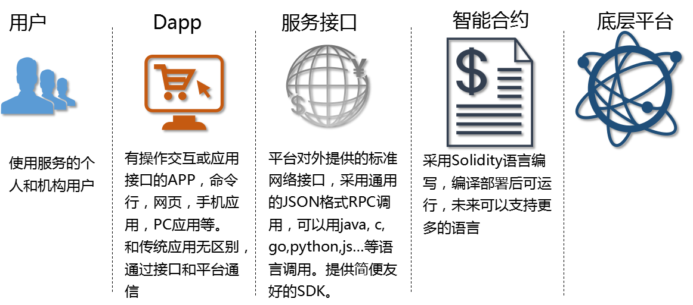
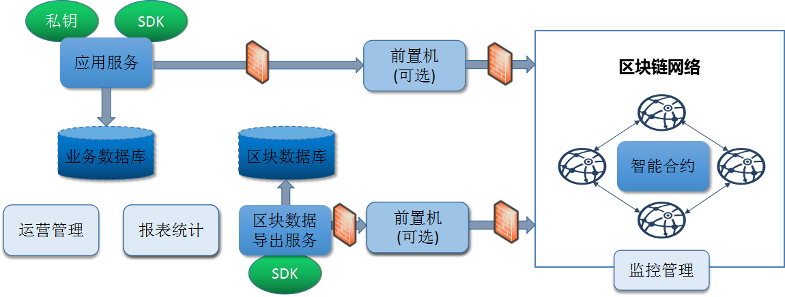

# 漫谈系列:区块链应用后台“混合架构”介绍 
**作者：fisco-dev**

本文从应用开发者的角度出发，介绍一个简单的区块链应用的“混合型”后台架构。

## 1.从分层到混合架构

区块链技术体系本身是分层的，如图所示。

如果基于已有区块链底层平台进行业务开发，应用开发者只需要关注Dapp的设计，服务接口调用，智能合约编写即可，这几个部分除了智能合约之外，基本上和传统的应用开发差异不太大。其实图灵完备的智能合约如sodility，作为一种受控的脚本语言，其语法的复杂性和API的数量，也都远远少于java，javascript，python等大家更为熟知的计算机语言，一般来说，有计算机基础的开发者用一到两周时间专注阅读开发文档和参考样例，基本上就可以写出通顺的智能合约了。

套用常见的后台业务系统MVC设计模式+数据持久层，看起来区块链+智能合约已经基本上可以应对大部分架构，那么是否由客户端直接往区块链发送请求，由智能合约完成业务逻辑，区块链进行分布式存储，客户端获取结果数据进行展示即可？这是一种理想情况，实际业务开展中，需要考虑以下因素：

1： 为了给客户端提供更好的体验（更安全的通信，更稳定的网络连接，更快的响应速度，更多的数据维度），通常需要有服务负责从各种网络接入客户端，进行协议转换，对数据进行缓存加速，整合丰富的数据包括图片视频等。

2： 庞大的业务模型里，有一部分只和机构内部逻辑有关，不需要上链进行分布式交易。如用户注册管理，竞价拍卖过程，买卖单撮合，营销活动等环节，未必都需要全程上链，只需要把需要跟踪的，或者和其他机构协同的部分上链。

3： 传统业务逐步上链，有一个中间过程，需要把传统业务和链上模块进行对接，并行旁路的运行。

4： 对数据需要归集处理的流程，如统计报表，大数据挖掘，相关性分析等，不适合直接在区块链上检索数据和运行计算任务，需要把数据导出在链下深度加工处理。

5： 和隐私相关的数据，需要在链下处理脱敏后再上链。

6： 专注于处理分布式事务的区块链底层平台不适合直接面向山呼海啸的海量用户请求，需要采用前置的上链流程进行削峰平谷，把并发访问变成异步处理。

区块链系统可以聚焦于在跨机构的、分布式的场景，实现准实时交易、数据流动、清结算等。而繁杂多变、计算密集、有特定隐私性要求的业务逻辑通常还是在链下完成，所以目前来看，“混合式架构“的应用开发，是比较务实的选择。

## 2. 混合架构解析

以下是一个典型的”混合架构“的概念图，基于这个架构图，可实现一个最小化的基于区块链的应用架构。以下对各模块进行一一介绍。

**应用服务**

面向具体业务逻辑的应用服务，如供应链、电商、存证、其他金融业务等。应用服务依旧可以用类似LAMP，EJB，SSH，微服务等成熟技术开发，业务数据库可用mysql，oracle等成熟的解决方案来存储不需上链的业务数据，如用户个人资料、商品介绍、仓储、营销推广数据等。 当在业务流程中产生了一笔需要上链的交易，如资产转移，由应用服务向区块链发起交易请求，并等待区块链共识确认。

应用服务可以引入私钥管理的模块，私钥由专用的算法进行加密妥善存储，由应用服务通过私钥管理模块加载并对交易签名。如机构是代理用户转发交易，交易是由用户自签名，则机构不需要管理用户私钥。

应用服务通过区块链平台提供的SDK发起交易，SDK向业务层封装网络通信，协议编解码，异常处理等细节，暴露友好的面向对象的功能接口，如智能合约定义的转账接口，应用服务面向接口编程，专注于实现业务逻辑，而不需要承担底层技术实现的开销。

应用服务和区块链通信有几种模式：

第一种，应用服务和区块链通信采用同步方式，即应用服务向区块链发起一个交易请求（sendTransaction），然后同步等待区块链系统处理反馈结果（getTransactionReceipt），再进行下一步操作。这种模式适用于强事务的场景，并发能力相对较低。

第二种，应用服务和区块链通信采用异步方式，即应用服务向区块链发起一个交易请求，然后继续处理下一个事务。区块链处理结果返回事件由sdk负责接管，SDK异步回调应用服务进行后续处理。这种模式相对灵活，并发表现较好，调度流程稍复杂，对编程要求略高，需要具备多线程，多通道，堵塞和竞争处理等基础知识。

第三种，应用服务和区块链处理流程进行隔离，应用服务将需要发往链上的交易先持久化，如放入数据库或队列，再由另一个上链服务定期从数据库或队列中pop出需要上链的数据，向区块链系统发送，并把区块链处理的结果写入数据库或队列。这种模式适用于应用业务流程能和分布式协作流程清晰解耦的业务场景，如实时交易收妥，再准实时的进行对账清结算或数据存证等。

这几种方式根据不同的业务场景要求可选，会在系统容量，并发吞吐能力，时延方面表现各有不同。

原则上应用服务和区块链系统之间要保证数据的”不错，不丢，不乱”，所以在应用服务和区块链系统之间可以有一个“对账”流程, 定期检查应用服务请求上链的数据是否被区块链系统正确处理，对漏发的，超时或未处理成功的数据应进行重发或差错控制，以保障业务质量。

**区块数据导出服务**

区块链通常被认为承担了“分布式数据库”的功能，区块链上每个节点确实保存了和全链一致的数据，在当前的实现中，区块数据通常是存在文件型数据库如leveldb里，所提供的RPC数据功能接口，一般是基于单个区块、交易、合约的key-value式查询。对数据的复杂检索，范围检索，批量检索，关系型检索...目前的区块链平台大多是不能直接支持的。

“数据导出服务”是一个用于构建“区块链数据仓库”的解决方案，使区块链和已经为人熟知的关系型数据，分布式数据库，大数据平台进行有机结合。

为区块链设置一个准实时的数据ETL（Extract-Transform-Load）流程，使得链上一旦新生成区块，就能立刻把相关的区块证明，区块里包含的交易列表、交易明细、交易结果、智能合约状态数据、链上配置信息等全部导入到链外的数据仓库里，数据仓库的数据只增不减，写入后不会再发生变化，且随时可以和链上数据源进行比对验证，保证其完整性和不可篡改性，借助数据仓库本身强大的查询能力、分析能力和数据挖掘能力，可以对区块链上产生的数据进行复杂的整合和加工，以满足商业智能、监管监控、反洗钱、数据报送等场景的需求。

数据导出服务里通用的部分如ETL定时任务，区块导出，交易导出，状态数据导出等，可以由区块链平台提供参考实现，具体到业务数据，如链上的订单数据，转账数据和交易结果等，则和业务密切相关，需要业务开发者针对具体的数据结构进行解析入库。区块链平台的SDK提供了数据解析的功能。

**智能合约**

智能合约是区块链系统的核心能力之一，图灵完备的智能合约可以让开发者天马行空的实现业务逻辑，且保证区块链网络上的事务性、一致性。

但另一方面来看，在区块链上运行智能合约相当于在消耗全网的计算资源，网络资源，存储资源，过于复杂的业务逻辑一旦依托智能合约实现，在当前的技术阶段，会使分布式网络难以承担。

所以，基于“混合式架构“的指导思想，在设计智能合约时应进行拆解，只有和跨机构协作共享相关的关键流程和数据，才需要使用智能合约实现。非关键的，或者单个机构就能完成的业务流程，以及详细的用户个人信息，商品描述数据，如文件，视频，音频等，都不需要使用智能合约描述，如需采用区块链对这些数据进行跟踪鉴证，可以使用摘要算法等方式，将不可篡改的数据摘要上链，把明文妥善保存在机构内，需要时再通过文件传输等方式进行共享。

智能合约虽然支持继承等面向对象的特性，但考虑到合约的可维护性，应尽量保持层次扁平，接口清晰，保持简洁的互相调用的关系，避免写出庞大的运行缓慢也难以维护的智能合约。

**前置机**

在高安全性要求的机构，不同的模块会部署到有防火墙隔离的区域，应用服务所在的区域甚至是无外网连接的，而区块链系统先天的需要和外界连接，所以机构内的应用服务通常需要通过部署在DMZ（隔离区）前置机进行代理转发，和区块链系统通信。应用服务和前置机，前置机和外网之间，都会通过防火墙隔离。

前置机可定位成一个“通信转发器”，对应用业务逻辑无介入，只进行必要的协议转换，把通信包在内外系统之间进行转发，且服务本身无状态，便于无差别的多活部署。

如果应用服务所在区域可直接和区块链所在的网络通信，则不需要使用前置机。

**其他**

做为完整的应用系统，运营管理，统计报表，监控运维系统等等都是必不可少的，采用混合架构的思路，新增的模块采用数据库读写、日志输出、RPC接口方式，即可以无缝和机构内部耕耘多年已经成型的IT系统进行结合。

## 3. 结语

综上所述，在混合架构中，

1.应用服务接入用户，面向复杂业务场景流程，产生交易数据

2.区块链+智能合约解决机构分布式协作和一致性问题

3.数据导出服务解决数据的后处理问题

链下的归链下，链上的归链上，各司其职，完成自己擅长的工作，才能达到1+1 > 2的成效。
