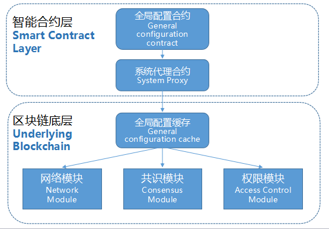

# 系统参数说明文档 #
**作者：fisco-dev**   
## 设计方式 ##
区块链网络通常是由多个网络节点组成的一个分布式系统，有一些参数配置是需要整个分布式系统的各个节点保持一致的，而且后续更新维护也需要做到全网同步，一致更新。 为此，在FISCO BCOS中引入了一种采用智能合约管理系统参数的方法，设计方式如下图所示：

## 系统参数列表 ##
### maxBlockTranscations ###
作用：控制一个块允许打包的最大交易数量上限

范围：(0,2000]

缺省值：1000

### intervalBlockTime ###
作用：控制出块间隔时间（单位：毫秒）

范围：大于等于1000

缺省值：1000

### maxBlockHeadGas ###
作用：控制一个块允许最大Gas消耗上限

范围：大于等于2,000,000,000

缺省值：2,000,000,000

### maxTranscationGas ###
作用：控制一笔交易允许最大Gas消耗上限

范围：大于等于30,000,000

缺省值：30,000,000

### maxNonceCheckBlock ###
作用：控制Nonce排重覆盖的块范围

范围：大于等于1000

缺省值：1000

### maxBlockLimit ###
作用：控制允许交易上链延迟的最大块范围

范围：大于等于1000

缺省值：1000

### CAVerify ###
作用：控制是否打开CA认证

范围：true 或者 false

缺省值：false

### omitEmptyBlock ###
作用：控制是否忽略空块（空块是指无交易的块，忽略空块是指不落盘存储空块）

范围：true 或者 false

缺省值：true

## 更改系统参数 ##
在创世块节点中执行命令，调用合约接口，更改参数配置（建议在创世块执行，理论上在其他节点也可以操作）

更改系统参数方式为：

    babel-node tool.js ConfigAction set 【参数名】 【参数值】

查看系统参数方式为：

    babel-node tool.js ConfigAction get 【参数名】

举例： 更改出块时间间隔（注意：参数值目前get/set都是以16进制计算表示的）

    cd systemcontractv2;
    babel-node tool.js ConfigAction set  intervalBlockTime  1000

举例： 允许空块落盘

    cd systemcontractv2;
    babel-node tool.js ConfigAction set  omitEmptyBlock false
